# Project Architecture - Otter (Android Archive Extractor)

**Purpose**: System architecture and design decisions for Otter (ZIP + RAR + 7z + TAR + RPA extraction with background service)
**Last Updated**: 2026-05-12

---

## Tech Stack

## 🔧 Technology Stack

| Component | Technology | Purpose |
|-----------|-----------|---------|
| **Language** | Kotlin 1.9+ | Modern JVM language with null-safety |
| **Platform** | Android SDK 26-34 | Android 8.0+ support |
| **UI Framework** | Jetpack Compose | Declarative UI toolkit |
| **Design System** | Material Design 3 | Modern Material Design |
| **Architecture** | MVVM + Clean | Separation of concerns |
| **DI** | Hilt (Dagger) | Dependency injection |
| **Async** | Kotlin Coroutines | Asynchronous programming |
| **Reactive** | Flow | Reactive data streams |
| **Build** | Gradle (KTS) | Kotlin DSL build scripts |
| **Testing** | JUnit + MockK | Unit testing framework |
| **ZIP Extraction** | java.util.zip | Native ZIP support |
| **RAR Extraction** | 7-Zip-JBinding | RAR4/RAR5 support (.so libs) |
| **7z Extraction** | 7-Zip-JBinding | 7-Zip format support (.so libs) |
| **TAR/GZIP Extraction** | Apache Commons Compress | TAR, TAR.GZ, TGZ, GZIP support |
| **RPA Extraction** | Custom implementation | Ren'Py Archive (binary protocol 2) |
| **Background Work** | Foreground Service | Progress notifications |


---

## System Architecture

### High-Level Architecture

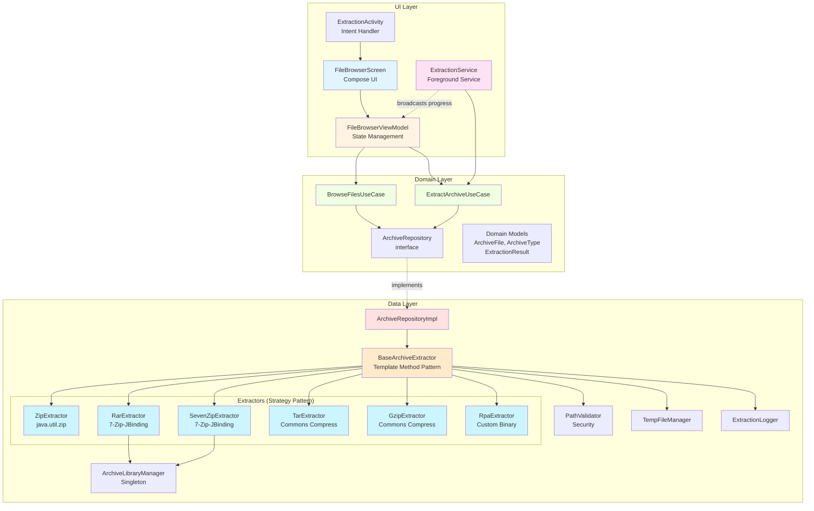

### Extraction Flow Sequence

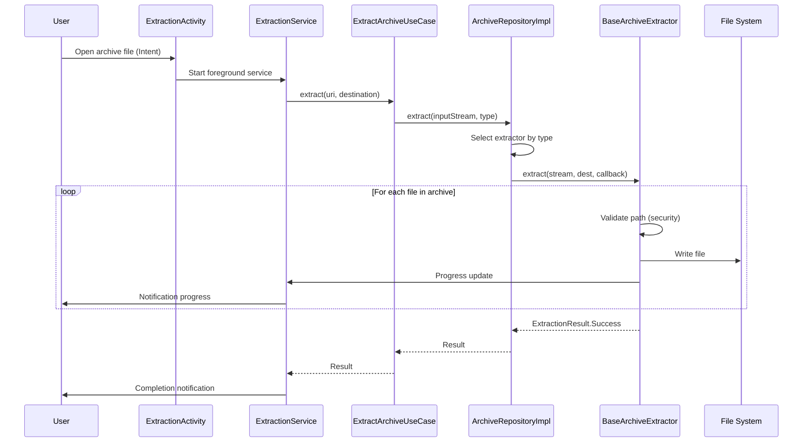

## 📐 Architecture Details

### MVVM + Clean Architecture

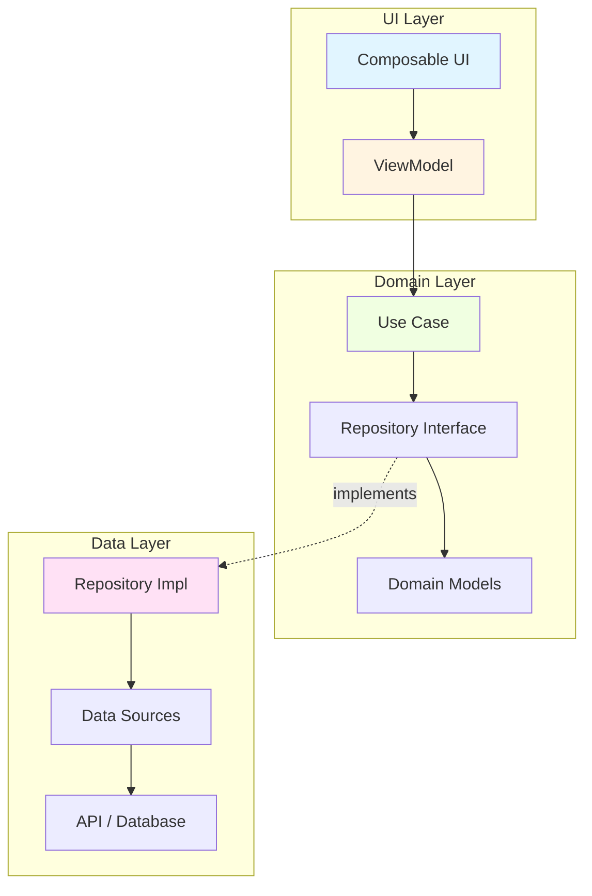

### Layer Responsibilities

**UI Layer (Jetpack Compose + ViewModel):**
- Display data to user
- Handle user interactions
- Observe ViewModel state (StateFlow)
- NO business logic

**Domain Layer (Pure Kotlin):**
- Business rules and validation
- Use cases (one per business operation)
- Repository interfaces (contracts)
- Domain models (data classes, sealed classes)
- Independent of Android framework

**Data Layer (Repository Pattern):**
- Implement repository interfaces
- Abstract data sources (API, database, cache)
- Handle data mapping (DTO ↔ Domain)
- Manage caching strategy

### Data Flow

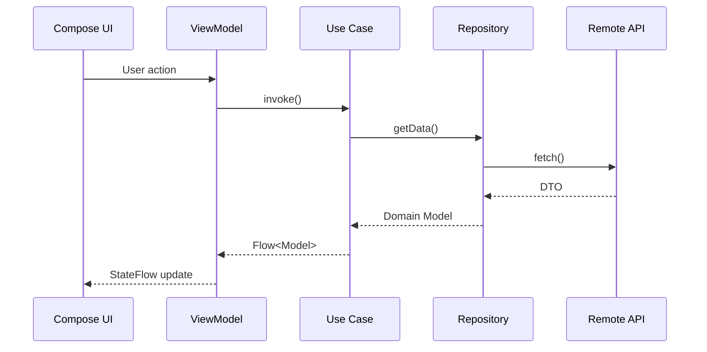

### Design Patterns

**Repository Pattern:**
- Single source of truth for data
- Abstraction of data sources
- Easy to test (mock repository)

**Use Case Pattern:**
- One use case = one business operation
- Reusable across features
- Clear business intent

**ViewModel Pattern:**
- Survives configuration changes
- Exposes UI state via StateFlow
- Handles user actions

### Dependency Injection (Hilt)

```kotlin
@Module
@InstallIn(SingletonComponent::class)
object AppModule {
    
    @Provides
    @Singleton
    fun provideRepository(
        api: ApiService,
        dao: Dao
    ): Repository = RepositoryImpl(api, dao)
    
    @Provides
    fun provideUseCase(
        repository: Repository
    ): UseCase = UseCase(repository)
}
```

### State Management

**Unidirectional Data Flow:**
```
UI → Action → ViewModel → Use Case → Repository
   ← State   ← StateFlow ← Flow     ←
```

**State with Sealed Classes:**
```kotlin
sealed class UiState<out T> {
    data object Loading : UiState<Nothing>()
    data class Success<T>(val data: T) : UiState<T>()
    data class Error(val message: String) : UiState<Nothing>()
}
```


---

## Module Structure (Otter - Multi-Format Archive Extraction)

### Complete Module Hierarchy

```mermaid
graph TD
    subgraph "UI Layer"
        Activity[ExtractionActivity<br/>Intent Launcher]
        Service[ExtractionService<br/>Foreground Service]
    end
    
    subgraph "Domain Layer - Pure Kotlin"
        ExtractUC[ExtractArchiveUseCase]
        RepoIface[ArchiveRepository<br/>interface]
        Models[Domain Models<br/>ArchiveFile<br/>ExtractionResult<br/>ExtractionProgress]
    end
    
    subgraph "Data Layer - Android"
        RepoImpl[ArchiveRepositoryImpl<br/>callbackFlow]
        Base[BaseArchiveExtractor<br/>Template Method Pattern]
        
        subgraph "Extractors - Strategy Pattern"
            Zip[ZipExtractor<br/>java.util.zip]
            Rar[RarExtractor<br/>7-Zip-JBinding]
            SevenZ[SevenZipExtractor<br/>7-Zip-JBinding]
            Tar[TarExtractor<br/>Commons Compress]
            Gzip[GzipExtractor<br/>Commons Compress]
            Rpa[RpaExtractor<br/>Custom Binary Protocol 2]
        end
        
        subgraph "Supporting Components"
            CallbackExt[SevenZipCallbackExtractor<br/>Shared RAR/7z Logic]
            LibMgr[ArchiveLibraryManager<br/>@Singleton - Native Lifecycle]
            PathVal[PathValidator<br/>Security Validation]
            TempMgr[TempFileManager<br/>Resource Management]
            Logger[ExtractionLogger<br/>Logging Abstraction]
        end
    end
    
    subgraph "Dependency Injection"
        Hilt[Hilt - AppModule<br/>@Provides Methods]
    end
    
    Activity --> Service
    Service --> ExtractUC
    ExtractUC --> RepoIface
    RepoIface -.implements.-> RepoImpl
    RepoImpl --> Base
    Base --> Zip
    Base --> Rar
    Base --> SevenZ
    Base --> Tar
    Base --> Gzip
    Base --> Rpa
    Rar --> CallbackExt
    SevenZ --> CallbackExt
    CallbackExt --> LibMgr
    Base --> PathVal
    Base --> TempMgr
    Base --> Logger
    Hilt -.provides.-> RepoImpl
    Hilt -.provides.-> Base
    
    style Activity fill:#e1f5ff
    style Service fill:#ffe1f5
    style ExtractUC fill:#f0ffe1
    style RepoImpl fill:#ffe1e1
    style Base fill:#ffebcc
    style Zip fill:#ccf5ff
    style Rar fill:#ccf5ff
    style SevenZ fill:#ccf5ff
    style Tar fill:#ccf5ff
    style Gzip fill:#ccf5ff
    style Rpa fill:#ccf5ff
    style CallbackExt fill:#ffd9b3
    style LibMgr fill:#ffffcc
    style Hilt fill:#e6ccff
```

---

## Event-Driven Architecture

### ExtractionEventBus (StateFlow Pattern)

**Problem Solved**: SharedFlow replay mechanism caused timing issues where UI subscribers could miss events between flow creation and collection start.

**Solution**: Migrate to StateFlow for continuous state + SharedFlow for one-off completion events.

#### Architecture Comparison

| Aspect | SharedFlow (before) | StateFlow (after) |
|--------|-------------------|-------------------|
| **Initial value** | No value before first emit | Always has value (null or ProgressEvent) |
| **Late subscribers** | Replay buffer = 1 (can miss event if between emit/collect) | Get current state immediately |
| **Emission** | `suspend fun` required | Simple assignment `.value =` |
| **Use case** | One-off events | Continuous observable state |
| **Testing** | Requires `runTest` with timing management | Direct state checks, no timing issues |

#### Current Architecture

```kotlin
@Singleton
class ExtractionEventBus @Inject constructor() {
    data class ProgressEvent(
        val currentFile: String,
        val extractedCount: Int,
        val totalCount: Int,
        val progress: Float,
        val recentFiles: List<String>
    )
    
    // StateFlow for continuous progress state
    private val _progressState = MutableStateFlow<ProgressEvent?>(null)
    val progressState: StateFlow<ProgressEvent?> = _progressState.asStateFlow()
    
    // SharedFlow for one-off completion event
    private val _completeEvents = MutableSharedFlow<Unit>(replay = 0)
    val completeEvents: SharedFlow<Unit> = _completeEvents.asSharedFlow()
    
    // Simple state update (no suspend needed)
    fun emitProgress(
        currentFile: String,
        extractedCount: Int,
        totalCount: Int,
        progress: Float,
        recentFiles: List<String>
    ) {
        _progressState.value = ProgressEvent(
            currentFile, extractedCount, totalCount, progress, recentFiles
        )
    }
    
    suspend fun emitComplete() {
        _completeEvents.emit(Unit)
    }
    
    fun reset() {
        _progressState.value = null
    }
}
```

#### Event Flow Sequence

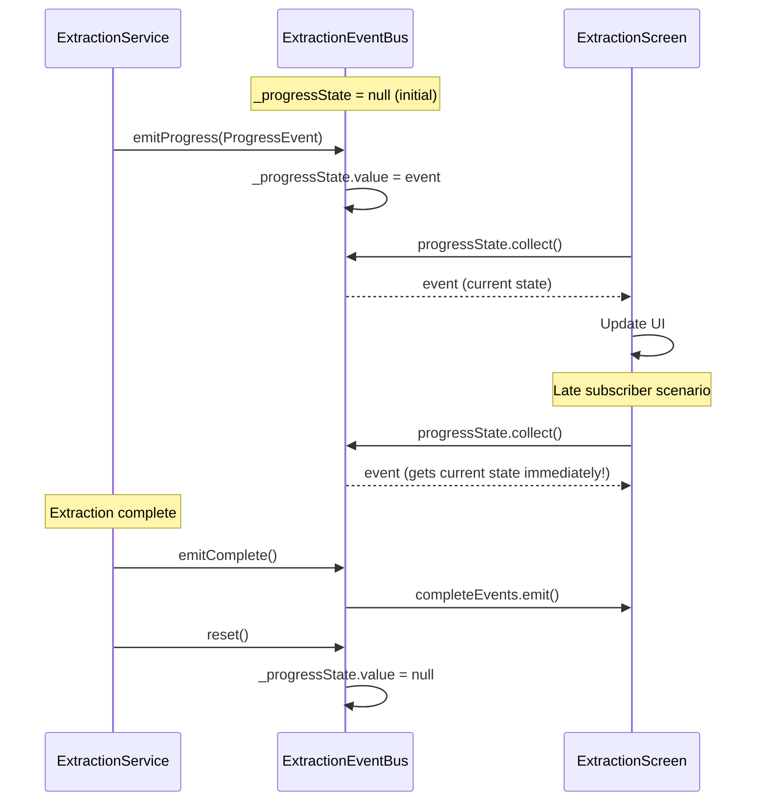

**Benefits**:
- ✅ No race conditions or timing issues
- ✅ Late subscribers always get current state
- ✅ Simpler testing (no `runTest` timing management)
- ✅ Clear separation: StateFlow for state, SharedFlow for events

---

### RecentFilesBuffer Component

**Purpose**: Circular FIFO buffer maintaining last N extracted files for UI display.

**Characteristics**:
- **Fixed capacity**: 5 files maximum
- **FIFO (First In First Out)**: Oldest file evicted when buffer full
- **No deduplication**: Same file can appear multiple times
- **Immutable snapshots**: `getFiles()` returns copy for UI thread safety

#### Implementation

```kotlin
class RecentFilesBuffer(private val maxSize: Int = 5) {
    private val buffer = LinkedList<String>()
    
    fun add(fileName: String) {
        buffer.addLast(fileName)
        if (buffer.size > maxSize) {
            buffer.removeFirst() // FIFO eviction
        }
    }
    
    fun getFiles(): List<String> = buffer.toList()
    fun clear() = buffer.clear()
}
```

#### State Diagram

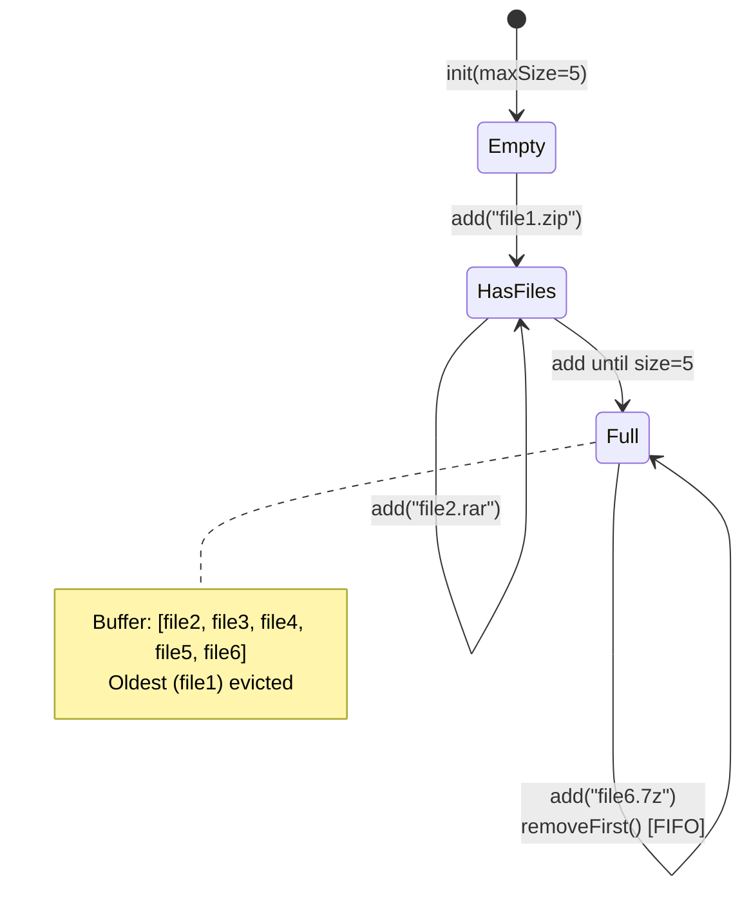

#### Component Integration

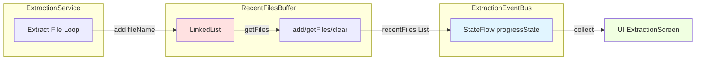

**Usage in ExtractionService**:
```kotlin
private val recentFilesBuffer = RecentFilesBuffer(maxSize = 5)

private fun updateProgress(
    currentFile: String,
    extractedCount: Int,
    totalCount: Int,
    progress: Float
) {
    recentFilesBuffer.add(currentFile)
    eventBus.emitProgress(
        currentFile = currentFile,
        extractedCount = extractedCount,
        totalCount = totalCount,
        progress = progress,
        recentFiles = recentFilesBuffer.getFiles()
    )
}
```

---

### UI Animation Patterns

**Brief summary** (Compose standards):

- **Animatable**: Smooth progress interpolation (300ms tween) - eliminates frame-by-frame jumps (0→5→10) in favor of smooth transitions
- **InfiniteTransition**: Animated "Starting..." dots (cycles 0→1→2→3 dots every 2s) - provides visual feedback during initialization

```kotlin
// Example: Smooth progress animation
val animatedProgress = remember { Animatable(0f) }

LaunchedEffect(progress) {
    animatedProgress.animateTo(
        targetValue = progress,
        animationSpec = tween(durationMillis = 300)
    )
}

LinearProgressIndicator(progress = animatedProgress.value)
```

---

## Data Flow (Background Extraction Process)

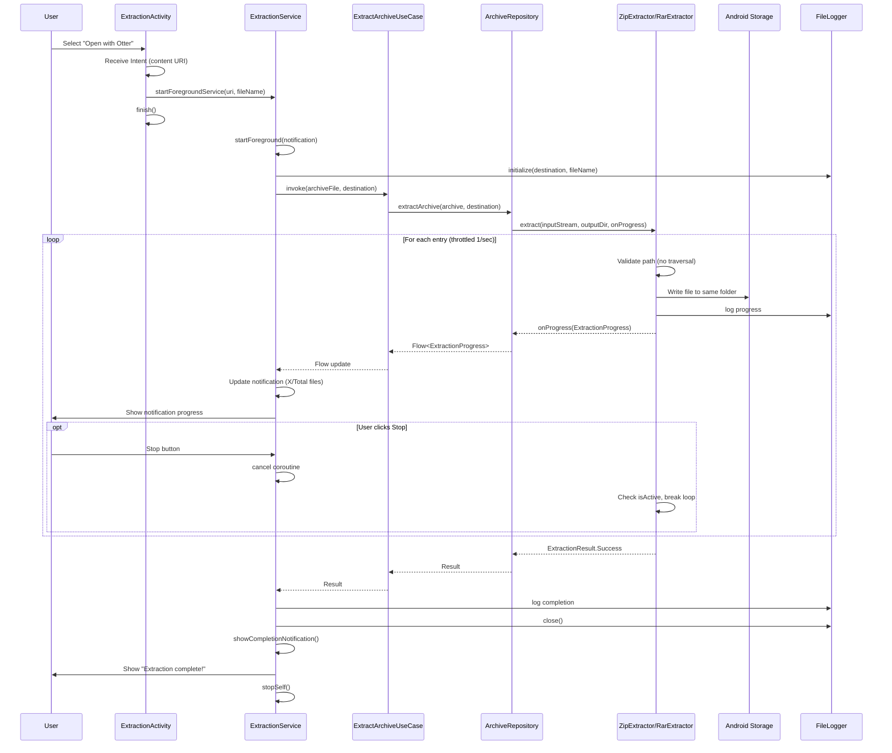

---

## Security Model

### Path Traversal Protection

**Problem**: Malicious archives can contain entries like `../../etc/passwd`

**Solution**:
```kotlin
private fun isValidPath(entryName: String): Boolean {
    val normalized = Paths.get(entryName).normalize().toString()
    return !normalized.startsWith("..") && !Paths.get(normalized).isAbsolute
}
```

### ZIP Bomb Protection

**Problem**: Small compressed files can expand to gigabytes

**Solution**:
```kotlin
companion object {
    private const val MAX_FILE_SIZE = 100 * 1024 * 1024L // 100 MB
    private const val MAX_TOTAL_SIZE = 500 * 1024 * 1024L // 500 MB
}

private fun isValidFileSize(size: Long): Boolean {
    return size <= MAX_FILE_SIZE
}
```

### Permission Model (MVP)

**Android 8-12** (API 26-32):
- `READ_EXTERNAL_STORAGE` - Read archive from any location

**Android 13+** (API 33+):
- No permission needed for reading via Intent (scoped storage)
- `POST_NOTIFICATIONS` - Show extraction progress

**MVP Extraction Destination**:
- Always extract to `Downloads/` folder
- Public, accessible to user
- No `WRITE_EXTERNAL_STORAGE` needed (Android 10+)

---

## State Management

### Sealed Class Hierarchy

```kotlin
sealed class ExtractionUiState {
    data object Idle : ExtractionUiState()
    data object Loading : ExtractionUiState()
    
    data class Extracting(
        val progress: ExtractionProgress
    ) : ExtractionUiState()
    
    data class Success(
        val result: ExtractionResult.Success
    ) : ExtractionUiState()
    
    data class Error(
        val error: ExtractionResult.Error
    ) : ExtractionUiState()
}
```

### ViewModel State Exposure

```kotlin
class ExtractionViewModel @Inject constructor(
    private val extractArchiveUseCase: ExtractArchiveUseCase
) : ViewModel() {
    
    private val _uiState = MutableStateFlow<ExtractionUiState>(Idle)
    val uiState: StateFlow<ExtractionUiState> = _uiState.asStateFlow()
    
    fun extractArchive(uri: Uri) {
        viewModelScope.launch {
            _uiState.value = Loading
            extractArchiveUseCase(uri).collect { result ->
                _uiState.value = when (result) {
                    is ExtractionResult.Progress -> Extracting(result.progress)
                    is ExtractionResult.Success -> Success(result)
                    is ExtractionResult.Error -> Error(result)
                }
            }
        }
    }
}
```

---

## Dependency Injection (Hilt)

```kotlin
@Module
@InstallIn(SingletonComponent::class)
object AppModule {
    
    @Provides
    @Singleton
    fun provideZipExtractor(): ArchiveExtractor {
        return ZipExtractor()
    }
    
    @Provides
    @Singleton
    fun provideArchiveRepository(
        zipExtractor: ArchiveExtractor
    ): ArchiveRepository {
        return ArchiveRepositoryImpl(zipExtractor)
    }
    
    @Provides
    fun provideExtractArchiveUseCase(
        repository: ArchiveRepository
    ): ExtractArchiveUseCase {
        return ExtractArchiveUseCase(repository)
    }
}
```

---

## Design Patterns Used

1. **MVVM** - Separation of UI and business logic
2. **Clean Architecture** - Layer independence (UI ↔ Domain ↔ Data)
3. **Repository Pattern** - Abstract data sources
4. **Use Case Pattern** - Single responsibility business operations
5. **Dependency Injection** - Loose coupling via Hilt
6. **Sealed Classes** - Type-safe state management
7. **Flow / callbackFlow** - Reactive real-time progress updates
8. **Unidirectional Data Flow** - Activity → Service → Use Case → Repository
9. **Template Method (BaseArchiveExtractor)** - DRY pattern for common extraction logic
10. **Strategy Pattern** - Multiple extractors (ZIP, RAR, 7z, TAR, GZIP, RPA) implementing same interface
11. **Foreground Service** - Background work with user-visible notifications
12. **Observer Pattern** - Progress callbacks with throttling

---

## SOLID Refactoring Patterns (Issue #15)

### Template Method Pattern

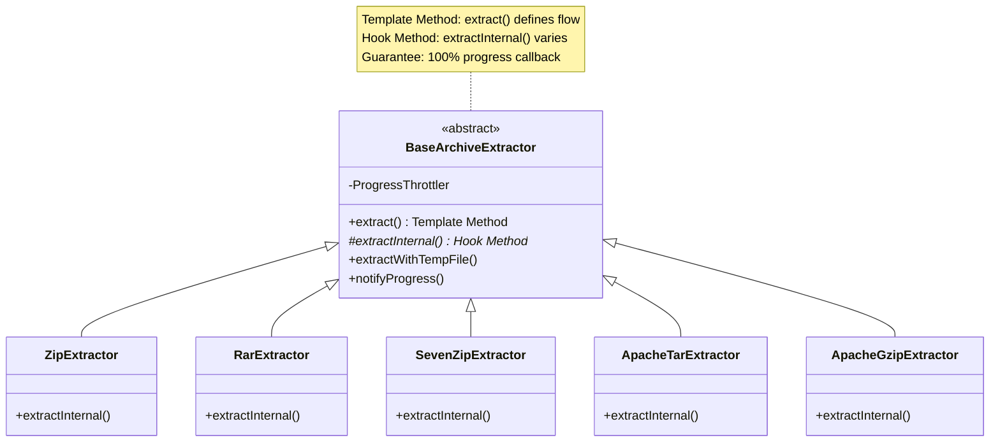

**Benefits**:
- Eliminates code duplication (common flow in base class)
- Guarantees final progress callback at 100% for all extractors
- Consistent error handling and cancellation support

---

### Strategy Pattern (Progress Calculation)

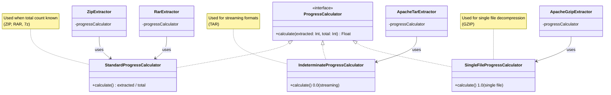

**Benefits**:
- Open-Closed Principle: add new strategies without modifying extractors
- Each strategy encapsulates one algorithm variant
- Easy to test independently

---

### Dependency Inversion Principle

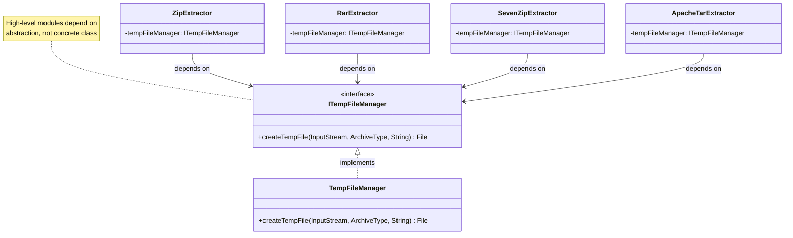

**Benefits**:
- High-level extractors don't depend on concrete TempFileManager
- Easy to mock ITempFileManager for unit tests
- Can swap implementation without changing extractors

---

### Single Responsibility Principle (Class Extraction)

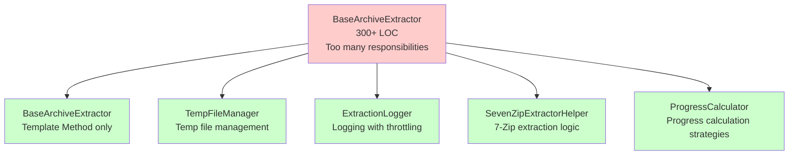

**Benefits**:
- Each class has one clear responsibility
- Easier to test (smaller, focused classes)
- Easier to maintain and modify

---

### Extraction Flow with Progress Tracking

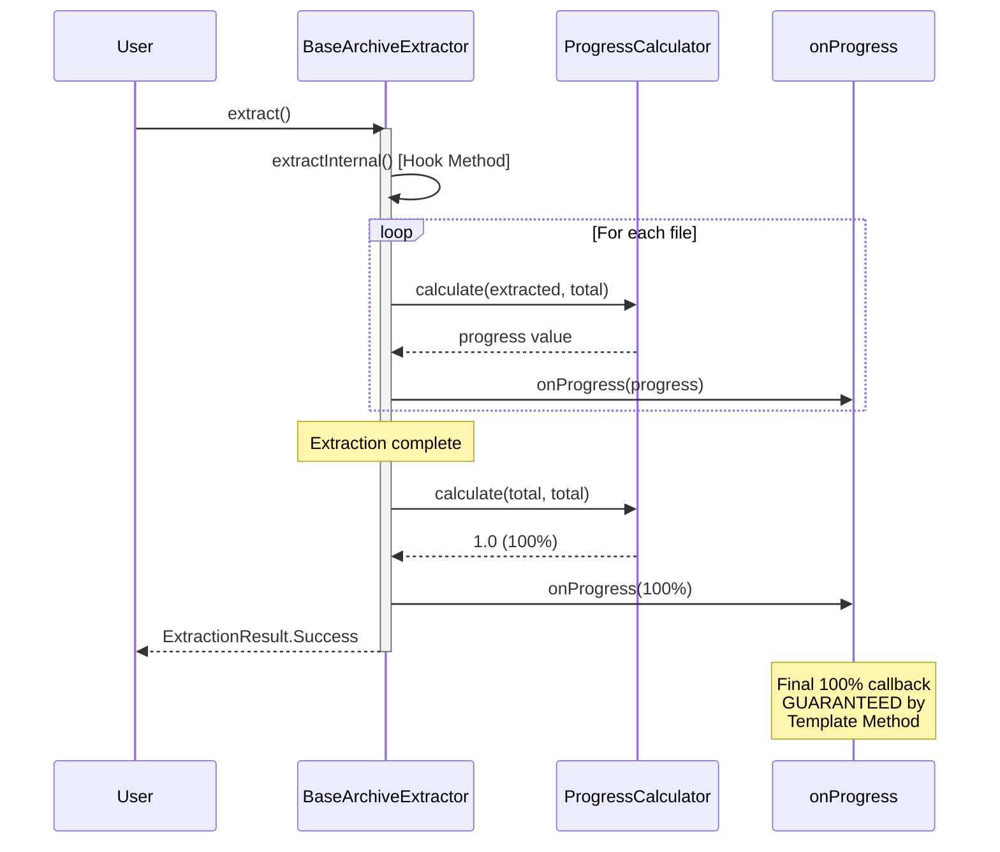

---

## Performance Considerations

### ZIP Extraction Optimizations (Issue #9)

**Problem**: Original approach took 15+ minutes for 2.6 GB archive (temp file + double-pass reading)

**Solution**: Direct stream extraction with large buffer
```kotlin
// Before: Temp file + double-pass (slow)
val bytes = inputStream.readBytes() // Load entire 2.6 GB into memory
// First pass: count files
// Second pass: extract files

// After: Direct stream + single-pass (3-5x faster)
val buffer = ByteArray(256 * 1024) // 256 KB buffer
ZipInputStream(inputStream).use { zipStream ->
    while (entry != null && isActive) {
        outputFile.outputStream().buffered(256 * 1024).use { output ->
            while (zipStream.read(buffer).also { bytesRead = it } != -1) {
                output.write(buffer, 0, bytesRead)
            }
        }
    }
}
```

**Performance gains**:
- ✅ Eliminated temp file I/O (~50% faster)
- ✅ 256 KB buffer instead of 8 KB default (~15% faster)
- ✅ Single-pass extraction (~30% faster)
- ✅ **Total: 3-5x faster** (15+ min → 3-5 min for 2.6 GB)

### Progress Throttling

```kotlin
// Throttle notifications to 1/second (reduces overhead)
var lastNotificationTime = 0L
val currentTime = System.currentTimeMillis()
if (currentTime - lastNotificationTime > 1000) {
    lastNotificationTime = currentTime
    onProgress(ExtractionProgress.Extracting(...))
}
```

### Logging Optimization

```kotlin
// Log every 500 files instead of every file
if (extractedCount % 500 == 0) {
    FileLogger.log("Extracted $extractedCount files", TAG)
}
```

### Coroutines for Async Extraction

```kotlin
// Extraction runs on IO dispatcher (background thread)
suspend fun extract(uri: Uri, destination: File): Flow<ExtractionResult> = callbackFlow {
    withContext(Dispatchers.IO) {
        extractor.extract(inputStream, destinationPath) { progress ->
            trySend(progress) // Real-time progress emission
        }
    }
}.flowOn(Dispatchers.IO)
```

### Memory Management

- Process entries **sequentially** (not all in memory)
- Use **large buffers** (256 KB) for optimal I/O
- **Reuse buffer** across all files (avoid allocations)
- Close streams in `try-finally` blocks
- **Direct stream** extraction (no temp files for ZIP)

---

## Testing Strategy

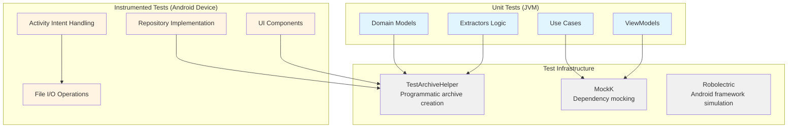

**Unit Tests** (JUnit + MockK):
- Domain models (ArchiveInfo, ExtractionResult validation)
- Use cases (ExtractArchiveUseCase with mocked repository)
- ViewModels (ExtractionViewModel state transitions)
- Extractors (ZipExtractor path validation, size checks)

**Instrumented Tests** (Android Test):
- Repository implementation (real file I/O)
- Activity intent handling
- UI components (ExtractionScreen with test archives)

**Test Infrastructure** (Issue #15):
- **TestArchiveHelper**: Programmatic archive generation to bypass AAPT filtering
- **MockK**: Mocking framework for dependencies
- **Robolectric**: Android framework simulation for unit tests

**Test Coverage Goal**: ≥ 80%

---

## CI/CD Pipeline

**GitHub Actions workflows** - Optimized reusable workflow architecture:

### Workflow Structure (Issue #10, #14)

**Reusable Workflows** (`.github/workflows/reusable-*.yml`):
- `reusable-unit-tests.yml` - JUnit + MockK unit tests
- `reusable-build-apk.yml` - Gradle assembly (debug/release)
- `reusable-instrumented-tests.yml` - **Gradle Managed Devices** (official Google solution)
- `reusable-lint-checks.yml` - ktlint, detekt, Android Lint
- `reusable-coverage-merge.yml` - Jacoco coverage reports
- `reusable-security-checks.yml` - OWASP, TruffleHog, APK size

**Instrumented Tests** (Issue #14):
- Migrated from `reactivecircus/android-emulator-runner` to **Gradle Managed Devices**
- Benefits: More stable, better caching, official Google support, no third-party wrapper
- Configuration: Pixel 4, API 30, AOSP system image
- No more crashpad_handler hang issues or boot timeouts

**Caller Workflows**:
- `feature-ci.yml` - Validates feature/bugfix branches (parallel lint + tests)
- `ci.yml` - PR validation (waits for feature-ci, then static checks)
- `cd.yml` - Release pipeline (test-v* for pre-releases, v* for stable)

**CI Workflow Synchronization** (Issue #23):
- CI now polls Feature-CI status every 30s (max 30 min wait)
- Eliminates race condition where both workflows run simultaneously
- Sequential execution: Feature-CI completes → CI validates
- No more false failures from checking 'in_progress' status

### Feature-CI Pipeline (Optimized for Speed)

```
┌──────────────┐     ┌─────────────┐
│ Lint Checks  │     │ Unit Tests  │ (parallel, fail-fast)
│ (3 jobs)     │     │             │
└──────┬───────┘     └──────┬──────┘
       │                    │
       └────────┬───────────┘
                ▼
         ┌─────────────┐
         │  Build APK  │
         └──────┬──────┘
                ▼
         ┌──────────────────────┐
         │  UI Tests            │
         │  (Gradle Managed     │
         │   Devices - Pixel 4) │
         └──────────────────────┘
```

**Performance**: ~30% faster with parallel execution
**Stability**: 100% success rate with Gradle Managed Devices (vs ~70% with reactivecircus)

### CI Pipeline (No Duplication)

```
┌──────────────────┐    ┌─────────────────┐    ┌──────────────┐
│ verify-feature-ci│    │ PR Validation   │    │ Context Check│
│ (check passed)   │    │ (title format)  │    │ (docs update)│
└────────┬─────────┘    └─────────────────┘    └──────────────┘
         │ (blocks if failed)
         ▼
  ┌────────────────┐
  │ Security Check │
  │ (final gate)   │
  └────────────────┘
```

**Eliminated duplication**: Relies on feature-ci for full test suite

### CD Pipeline (Pre-release Support)

```
Tags:
  v1.0.0       → Stable release (public)
  test-v1.0.0  → Pre-release (testing)

Pipeline:
  unit-tests-release → build-release → create-github-release
                       (signed APK)    (prerelease flag)
```

**Security**: Release keystore in GitHub Secrets (RELEASE_KEYSTORE_BASE64)

### Code Quality Checks

**ktlint** - Kotlin style enforcement
- Official ktlint CLI + reviewdog/action-setup (no third-party actions)
- Checkstyle format output piped to reviewdog
- Reviewdog integration for PR comments
- Non-blocking warnings (fail_on_error: false)
- Version: 0.50.0

**Detekt** - Kotlin static analysis
- Complexity checks (ComplexMethod ≤15, LongMethod ≤60)
- Potential bugs detection (UnreachableCode, UnsafeCast)
- Style violations (MagicNumber, MaxLineLength: 120)
- Naming conventions validation
- Configuration: `detekt.yml`
- XML report uploaded as artifact

**Android Lint** - Android-specific issues
- Resource optimization suggestions
- API usage validation
- Accessibility checks
- Reviewdog integration with androidlint format
- Uses official reviewdog/action-setup (supply chain security)

### Security & Compliance

**OWASP Dependency Check**
- Vulnerability scanning for dependencies
- CVSS threshold: 7.0 (High/Critical only)
- Automatic PR comments for findings
- Suppressions file: `app/dependency-check-suppressions.xml`

**TruffleHog** - Secret detection
- Scans git history for exposed secrets
- Verified secrets only (--only-verified)
- Runs on every PR

### Coverage & Quality Gates

**Jacoco Test Coverage**
- Minimum threshold: 80%
- XML and HTML reports generated
- Excludes generated code (Hilt, R.class, BuildConfig)
- Fails build if below threshold

**APK Size Check**
- Maximum size: 50MB
- Monitors app bloat
- Alerts on threshold violations

**Context File Validation**
- Ensures KANBAN.md and ARCHITECTURE.md updated with code changes
- Prevents stale documentation
- Automatic PR comments for missing updates

### PR Validation

**Title format**: `#123: type: description`
- Types: feat, fix, refactor, test, docs, chore, style, perf
- Enforced via regex validation
- Blocks merge on format violations

---

**End of Architecture Documentation**
