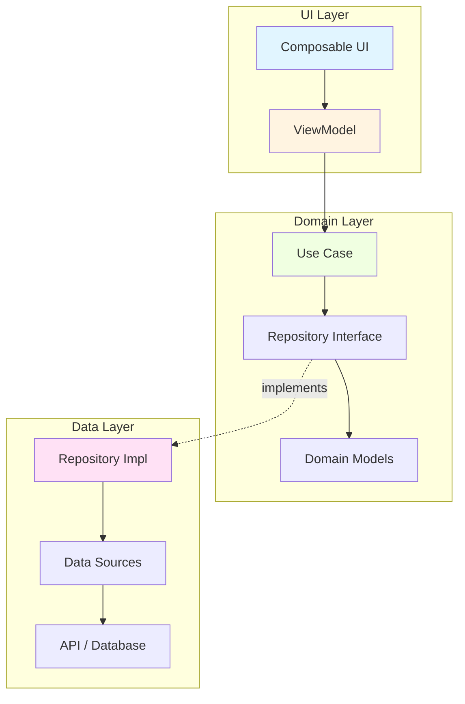
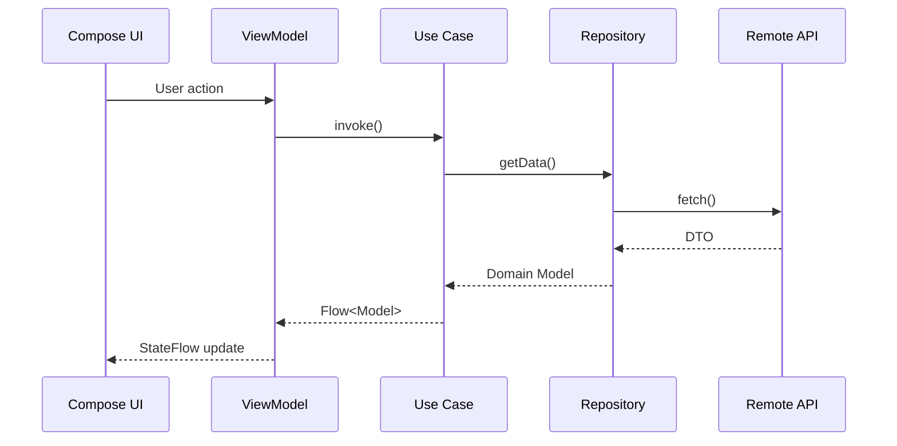
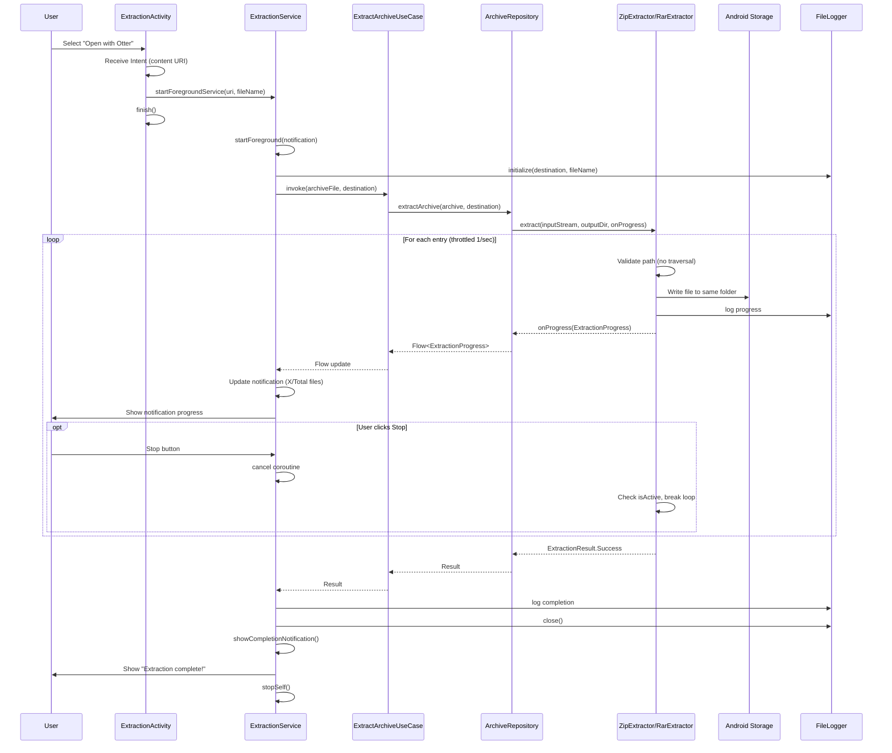

# Project Architecture - Otter (Android Archive Extractor)

**Purpose**: System architecture and design decisions for Otter (ZIP + RAR extraction with background service)
**Last Updated**: 2026-04-16

---

## Tech Stack

## 🔧 Technology Stack

| Component | Technology | Purpose |
|-----------|-----------|---------|
| **Language** | Kotlin 1.9+ | Modern JVM language with null-safety |
| **Platform** | Android SDK 26-34 | Android 8.0+ support |
| **UI Framework** | Jetpack Compose | Declarative UI toolkit |
| **Design System** | Material Design 3 | Modern Material Design |
| **Architecture** | MVVM + Clean | Separation of concerns |
| **DI** | Hilt (Dagger) | Dependency injection |
| **Async** | Kotlin Coroutines | Asynchronous programming |
| **Reactive** | Flow | Reactive data streams |
| **Build** | Gradle (KTS) | Kotlin DSL build scripts |
| **Testing** | JUnit + MockK | Unit testing framework |
| **ZIP Extraction** | java.util.zip | Native ZIP support |
| **RAR Extraction** | 7-Zip-JBinding | RAR4/RAR5 support (.so libs) |
| **Background Work** | Foreground Service | Progress notifications |


---

## System Architecture

{{ARCHITECTURE_DIAGRAM}}

## 📐 Architecture Details

### MVVM + Clean Architecture



### Layer Responsibilities

**UI Layer (Jetpack Compose + ViewModel):**
- Display data to user
- Handle user interactions
- Observe ViewModel state (StateFlow)
- NO business logic

**Domain Layer (Pure Kotlin):**
- Business rules and validation
- Use cases (one per business operation)
- Repository interfaces (contracts)
- Domain models (data classes, sealed classes)
- Independent of Android framework

**Data Layer (Repository Pattern):**
- Implement repository interfaces
- Abstract data sources (API, database, cache)
- Handle data mapping (DTO ↔ Domain)
- Manage caching strategy

### Data Flow



### Design Patterns

**Repository Pattern:**
- Single source of truth for data
- Abstraction of data sources
- Easy to test (mock repository)

**Use Case Pattern:**
- One use case = one business operation
- Reusable across features
- Clear business intent

**ViewModel Pattern:**
- Survives configuration changes
- Exposes UI state via StateFlow
- Handles user actions

### Dependency Injection (Hilt)

```kotlin
@Module
@InstallIn(SingletonComponent::class)
object AppModule {
    
    @Provides
    @Singleton
    fun provideRepository(
        api: ApiService,
        dao: Dao
    ): Repository = RepositoryImpl(api, dao)
    
    @Provides
    fun provideUseCase(
        repository: Repository
    ): UseCase = UseCase(repository)
}
```

### State Management

**Unidirectional Data Flow:**
```
UI → Action → ViewModel → Use Case → Repository
   ← State   ← StateFlow ← Flow     ←
```

**State with Sealed Classes:**
```kotlin
sealed class UiState<out T> {
    data object Loading : UiState<Nothing>()
    data class Success<T>(val data: T) : UiState<T>()
    data class Error(val message: String) : UiState<Nothing>()
}
```


---

## Module Structure (Otter - ZIP + RAR + Background Service)

```
┌─────────────────────────────────────────────────────────────┐
│                UI Layer (Activity + Service)                 │
│  ┌──────────────────┐         ┌─────────────────────────┐  │
│  │ExtractionActivity│────────►│  ExtractionService      │  │
│  │  (launcher)      │         │  (foreground service)   │  │
│  └──────────────────┘         │  - Progress notifications│  │
│                                │  - User cancellation     │  │
│                                │  - FileLogger           │  │
│                                └─────────────────────────┘  │
│                                           │                  │
└───────────────────────────────────────────┼──────────────────┘
                                            ▼
                              ┌──────────────────────┐
                              │  Domain Layer (Pure) │
                              │  ┌──────────────────┐│
                              │  │ExtractArchiveUseCase││
                              │  └──────────────────┘│
                              │         ▼            │
                              │  ┌──────────────────┐│
                              │  │ArchiveRepository │ (interface)
                              │  └──────────────────┘│
                              │         ▲            │
                              │  ┌──────────────────┐│
                              │  │  Domain Models   ││
                              │  │ (ArchiveFile,    ││
                              │  │  ExtractionResult│
                              │  │  ExtractionProgress)││
                              │  └──────────────────┘│
                              └──────────────────────┘
                                        │
                                        ▼
                              ┌───────────────────────────────┐
                              │   Data Layer (Android)         │
                              │  ┌──────────────────────────┐ │
                              │  │  ArchiveRepositoryImpl   │ │
                              │  │  (callbackFlow)          │ │
                              │  └──────────────────────────┘ │
                              │           ▼                    │
                              │  ┌──────────────────────────┐ │
                              │  │  BaseArchiveExtractor    │ │
                              │  │  (DRY pattern)           │ │
                              │  └──────────────────────────┘ │
                              │     ▲                      ▲   │
                              │     │                      │   │
                              │  ┌──┴─────────┐   ┌───────┴──┐│
                              │  │ZipExtractor│   │RarExtractor││
                              │  │(direct     │   │(7-Zip    ││
                              │  │ stream,    │   │ JBinding)││
                              │  │ 256KB buf) │   │          ││
                              │  └────────────┘   └──────────┘│
                              │           ▼                    │
                              │  ┌──────────────────────────┐ │
                              │  │  Android Storage         │ │
                              │  │  (same folder as archive)│ │
                              │  └──────────────────────────┘ │
                              │           ▼                    │
                              │  ┌──────────────────────────┐ │
                              │  │  FileLogger (util)       │ │
                              │  │  (extraction logs .txt)  │ │
                              │  └──────────────────────────┘ │
                              └───────────────────────────────┘
                                        │
                                        ▼
                              ┌─────────────────────┐
                              │  Hilt DI (AppModule)│
                              └─────────────────────┘
```

---

## Data Flow (Background Extraction Process)



---

## Security Model

### Path Traversal Protection

**Problem**: Malicious archives can contain entries like `../../etc/passwd`

**Solution**:
```kotlin
private fun isValidPath(entryName: String): Boolean {
    val normalized = Paths.get(entryName).normalize().toString()
    return !normalized.startsWith("..") && !Paths.get(normalized).isAbsolute
}
```

### ZIP Bomb Protection

**Problem**: Small compressed files can expand to gigabytes

**Solution**:
```kotlin
companion object {
    private const val MAX_FILE_SIZE = 100 * 1024 * 1024L // 100 MB
    private const val MAX_TOTAL_SIZE = 500 * 1024 * 1024L // 500 MB
}

private fun isValidFileSize(size: Long): Boolean {
    return size <= MAX_FILE_SIZE
}
```

### Permission Model (MVP)

**Android 8-12** (API 26-32):
- `READ_EXTERNAL_STORAGE` - Read archive from any location

**Android 13+** (API 33+):
- No permission needed for reading via Intent (scoped storage)
- `POST_NOTIFICATIONS` - Show extraction progress

**MVP Extraction Destination**:
- Always extract to `Downloads/` folder
- Public, accessible to user
- No `WRITE_EXTERNAL_STORAGE` needed (Android 10+)

---

## State Management

### Sealed Class Hierarchy

```kotlin
sealed class ExtractionUiState {
    data object Idle : ExtractionUiState()
    data object Loading : ExtractionUiState()
    
    data class Extracting(
        val progress: ExtractionProgress
    ) : ExtractionUiState()
    
    data class Success(
        val result: ExtractionResult.Success
    ) : ExtractionUiState()
    
    data class Error(
        val error: ExtractionResult.Error
    ) : ExtractionUiState()
}
```

### ViewModel State Exposure

```kotlin
class ExtractionViewModel @Inject constructor(
    private val extractArchiveUseCase: ExtractArchiveUseCase
) : ViewModel() {
    
    private val _uiState = MutableStateFlow<ExtractionUiState>(Idle)
    val uiState: StateFlow<ExtractionUiState> = _uiState.asStateFlow()
    
    fun extractArchive(uri: Uri) {
        viewModelScope.launch {
            _uiState.value = Loading
            extractArchiveUseCase(uri).collect { result ->
                _uiState.value = when (result) {
                    is ExtractionResult.Progress -> Extracting(result.progress)
                    is ExtractionResult.Success -> Success(result)
                    is ExtractionResult.Error -> Error(result)
                }
            }
        }
    }
}
```

---

## Dependency Injection (Hilt)

```kotlin
@Module
@InstallIn(SingletonComponent::class)
object AppModule {
    
    @Provides
    @Singleton
    fun provideZipExtractor(): ArchiveExtractor {
        return ZipExtractor()
    }
    
    @Provides
    @Singleton
    fun provideArchiveRepository(
        zipExtractor: ArchiveExtractor
    ): ArchiveRepository {
        return ArchiveRepositoryImpl(zipExtractor)
    }
    
    @Provides
    fun provideExtractArchiveUseCase(
        repository: ArchiveRepository
    ): ExtractArchiveUseCase {
        return ExtractArchiveUseCase(repository)
    }
}
```

---

## Design Patterns Used

1. **MVVM** - Separation of UI and business logic
2. **Clean Architecture** - Layer independence (UI ↔ Domain ↔ Data)
3. **Repository Pattern** - Abstract data sources
4. **Use Case Pattern** - Single responsibility business operations
5. **Dependency Injection** - Loose coupling via Hilt
6. **Sealed Classes** - Type-safe state management
7. **Flow / callbackFlow** - Reactive real-time progress updates
8. **Unidirectional Data Flow** - Activity → Service → Use Case → Repository
9. **Template Method (BaseArchiveExtractor)** - DRY pattern for common extraction logic
10. **Strategy Pattern** - Multiple extractors (ZIP, RAR) implementing same interface
11. **Foreground Service** - Background work with user-visible notifications
12. **Observer Pattern** - Progress callbacks with throttling

---

## Performance Considerations

### ZIP Extraction Optimizations (Issue #9)

**Problem**: Original approach took 15+ minutes for 2.6 GB archive (temp file + double-pass reading)

**Solution**: Direct stream extraction with large buffer
```kotlin
// Before: Temp file + double-pass (slow)
val bytes = inputStream.readBytes() // Load entire 2.6 GB into memory
// First pass: count files
// Second pass: extract files

// After: Direct stream + single-pass (3-5x faster)
val buffer = ByteArray(256 * 1024) // 256 KB buffer
ZipInputStream(inputStream).use { zipStream ->
    while (entry != null && isActive) {
        outputFile.outputStream().buffered(256 * 1024).use { output ->
            while (zipStream.read(buffer).also { bytesRead = it } != -1) {
                output.write(buffer, 0, bytesRead)
            }
        }
    }
}
```

**Performance gains**:
- ✅ Eliminated temp file I/O (~50% faster)
- ✅ 256 KB buffer instead of 8 KB default (~15% faster)
- ✅ Single-pass extraction (~30% faster)
- ✅ **Total: 3-5x faster** (15+ min → 3-5 min for 2.6 GB)

### Progress Throttling

```kotlin
// Throttle notifications to 1/second (reduces overhead)
var lastNotificationTime = 0L
val currentTime = System.currentTimeMillis()
if (currentTime - lastNotificationTime > 1000) {
    lastNotificationTime = currentTime
    onProgress(ExtractionProgress.Extracting(...))
}
```

### Logging Optimization

```kotlin
// Log every 500 files instead of every file
if (extractedCount % 500 == 0) {
    FileLogger.log("Extracted $extractedCount files", TAG)
}
```

### Coroutines for Async Extraction

```kotlin
// Extraction runs on IO dispatcher (background thread)
suspend fun extract(uri: Uri, destination: File): Flow<ExtractionResult> = callbackFlow {
    withContext(Dispatchers.IO) {
        extractor.extract(inputStream, destinationPath) { progress ->
            trySend(progress) // Real-time progress emission
        }
    }
}.flowOn(Dispatchers.IO)
```

### Memory Management

- Process entries **sequentially** (not all in memory)
- Use **large buffers** (256 KB) for optimal I/O
- **Reuse buffer** across all files (avoid allocations)
- Close streams in `try-finally` blocks
- **Direct stream** extraction (no temp files for ZIP)

---

## Testing Strategy

**Unit Tests** (JUnit + MockK):
- Domain models (ArchiveInfo, ExtractionResult validation)
- Use cases (ExtractArchiveUseCase with mocked repository)
- ViewModels (ExtractionViewModel state transitions)
- Extractors (ZipExtractor path validation, size checks)

**Instrumented Tests** (Android Test):
- Repository implementation (real file I/O)
- Activity intent handling
- UI components (ExtractionScreen with test archives)

**Test Coverage Goal**: ≥ 80%

---

**End of Architecture Documentation**
