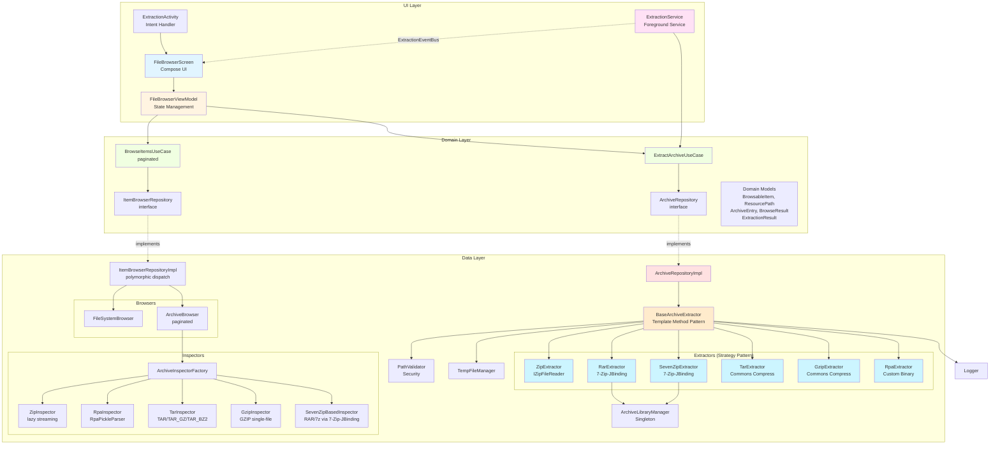
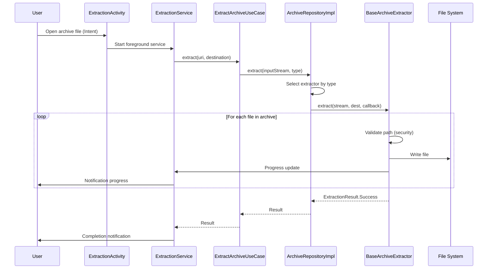
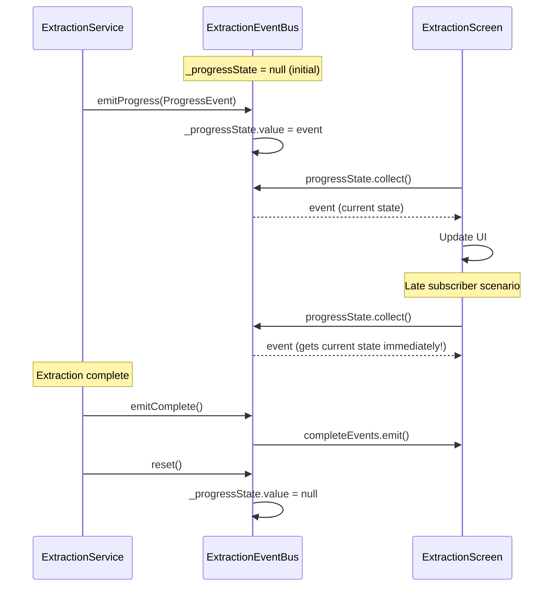
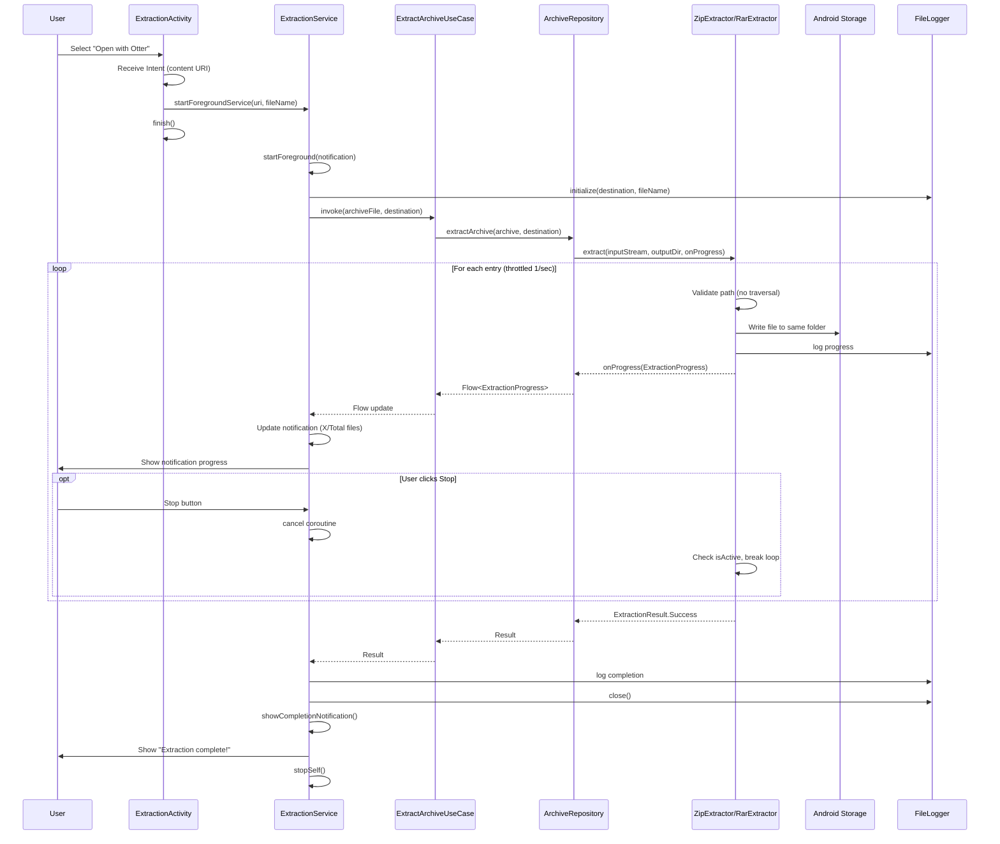
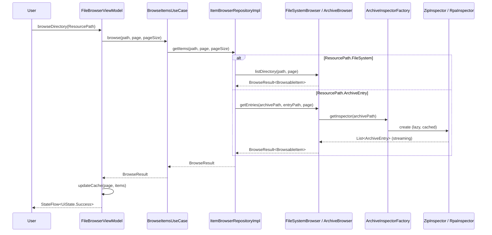

# Project Architecture - Otter (Android Archive Extractor)

**Purpose**: System architecture and design decisions for Otter (ZIP + RAR + 7z + TAR + RPA extraction with background service)
**Last Updated**: 2026-08-06

---

## Tech Stack

| Component | Technology | Purpose |
|-----------|-----------|---------|
| **Language** | Kotlin 1.9+ | Modern JVM language with null-safety |
| **Platform** | Android SDK 26-34 | Android 8.0+ support |
| **UI Framework** | Jetpack Compose | Declarative UI toolkit |
| **Design System** | Material Design 3 | Modern Material Design |
| **Architecture** | MVVM + Clean | Separation of concerns |
| **DI** | Hilt (Dagger) | Dependency injection |
| **Async** | Kotlin Coroutines | Asynchronous programming |
| **Reactive** | Flow | Reactive data streams |
| **Build** | Gradle (KTS) + Python scripts (manage.py) | Kotlin DSL + cross-platform build/test/ADB automation via OOP DI scripts; pytest-xdist (-n auto) for unit + integ-mock Python suites |
| **Testing** | JUnit + MockK + Coroutines Test | See `contexts/tests.md` for current counts |
| **ZIP Extraction** | java.util.zip + IZipFileReader | Native ZIP (testable via interface) |
| **RAR Extraction** | 7-Zip-JBinding + MultiVolumeCallback | RAR4/RAR5 + split-archive (.part1.rar) support |
| **7z Extraction** | 7-Zip-JBinding + MultiVolumeCallback | 7-Zip format + split-archive (.7z.001) support |
| **TAR/GZIP Extraction** | Apache Commons Compress | TAR, TAR.GZ, TGZ, GZIP support |
| **RPA Extraction** | Custom (RpaPickleParser) | Ren'Py Archive (binary protocol 2) |
| **Archive Inspection** | ZipInspector, RpaInspector, TarInspector, GzipInspector, SevenZipBasedInspector | Lazy streaming entry enumeration for all supported formats |
| **Background Work** | Foreground Service + ExtractionQueue | Progress notifications, FIFO queue |

---

## System Architecture

### High-Level Architecture



### Extraction Flow Sequence



---

## Event-Driven Architecture

### ExtractionEventBus (StateFlow Pattern)

**Problem Solved**: SharedFlow replay mechanism caused timing issues where UI subscribers could miss events between flow creation and collection start.

**Solution**: Migrate to StateFlow for continuous state + SharedFlow for one-off completion events.

#### Architecture Comparison

| Aspect | SharedFlow (before) | StateFlow (after) |
|--------|-------------------|-------------------|
| **Initial value** | No value before first emit | Always has value (null or ProgressEvent) |
| **Late subscribers** | Replay buffer = 1 (can miss event if between emit/collect) | Get current state immediately |
| **Emission** | `suspend fun` required | Simple assignment `.value =` |
| **Use case** | One-off events | Continuous observable state |
| **Testing** | Requires `runTest` with timing management | Direct state checks, no timing issues |

#### Current Architecture

```kotlin
@Singleton
class ExtractionEventBus @Inject constructor() {
    data class ProgressEvent(
        val currentFile: String,
        val extractedCount: Int,
        val totalCount: Int,
        val progress: Float,
        val recentFiles: List<String>
    )
    
    private val _progressState = MutableStateFlow<ProgressEvent?>(null)
    val progressState: StateFlow<ProgressEvent?> = _progressState.asStateFlow()
    
    private val _completeEvents = MutableSharedFlow<Unit>(replay = 0)
    val completeEvents: SharedFlow<Unit> = _completeEvents.asSharedFlow()
    
    fun emitProgress(
        currentFile: String,
        extractedCount: Int,
        totalCount: Int,
        progress: Float,
        recentFiles: List<String>
    ) {
        _progressState.value = ProgressEvent(
            currentFile, extractedCount, totalCount, progress, recentFiles
        )
    }
    
    suspend fun emitComplete() {
        _completeEvents.emit(Unit)
    }
    
    fun reset() {
        _progressState.value = null
    }
}
```

#### Event Flow Sequence



**Benefits**:
- ✅ No race conditions or timing issues
- ✅ Late subscribers always get current state
- ✅ Simpler testing (no `runTest` timing management)
- ✅ Clear separation: StateFlow for state, SharedFlow for events

---

### RecentFilesBuffer Component

**Purpose**: Circular FIFO buffer maintaining last N extracted files for UI display.

- **Fixed capacity**: 5 files maximum
- **FIFO**: Oldest file evicted when buffer full
- **Immutable snapshots**: `getFiles()` returns copy for UI thread safety

```kotlin
class RecentFilesBuffer(private val maxSize: Int = 5) {
    private val buffer = LinkedList<String>()
    
    fun add(fileName: String) {
        buffer.addLast(fileName)
        if (buffer.size > maxSize) {
            buffer.removeFirst()
        }
    }
    
    fun getFiles(): List<String> = buffer.toList()
    fun clear() = buffer.clear()
}
```

---

### UI Animation Patterns

- **Animatable**: Smooth progress interpolation (300ms tween) — eliminates frame-by-frame jumps
- **InfiniteTransition**: Animated "Starting..." dots (cycles 0→1→2→3 dots every 2s)

```kotlin
val animatedProgress = remember { Animatable(0f) }

LaunchedEffect(progress) {
    animatedProgress.animateTo(
        targetValue = progress,
        animationSpec = tween(durationMillis = 300)
    )
}

LinearProgressIndicator(progress = animatedProgress.value)
```

---

## Data Flow (Background Extraction Process)



---

## Archive Browsing (#25)

### Domain Model: Sealed Classes

```kotlin
sealed class ResourcePath {
    data class FileSystem(val path: String) : ResourcePath()
    data class ArchiveEntry(val archivePath: String, val entryPath: String) : ResourcePath()
    data class ContentUri(val uri: String) : ResourcePath()  // Samsung My Files URIs
}

sealed class BrowsableItem {
    data class FileSystemFile(val path: String, val name: String, val sizeBytes: Long, ...) : BrowsableItem()
    data class FileSystemDirectory(val path: String, val name: String) : BrowsableItem()
    data class ArchiveFile(val resourcePath: ResourcePath.ArchiveEntry, val name: String, ...) : BrowsableItem()
    data class ArchiveDirectory(val resourcePath: ResourcePath.ArchiveEntry, val name: String) : BrowsableItem()
}
```

### Archive Browsing Flow



### Sliding Window Cache

Memory-efficient browsing for archives with 100k+ entries:

```
Constants (FileBrowserViewModel):
  PAGE_SIZE    = 200   entries loaded per page request
  HALF_WINDOW  = 100   pages retained on each side of viewport
  LOAD_TRIGGER = 60    pages from window edge → triggers background load

State:
  cachedPages: Map<Int, List<BrowsableItem>>  sparse page map
  minCachedPage / maxCachedPage               current window bounds
  totalItems: Int                             total entry count

Scroll detection (onScrollPositionChanged):
  absoluteIndex > maxCachedIndex - LOAD_TRIGGER  → loadNextPage()
  absoluteIndex < minCachedIndex + LOAD_TRIGGER  → loadPreviousPage()
  cleanup: evict pages outside [current - HALF_WINDOW, current + HALF_WINDOW]

Fast-scroll guard:
  lastKnownAbsoluteIndex prevents redundant consecutive loads
  hasMore=false short-circuits load at archive boundaries
```

### Samsung content:// URI Handling

Samsung My Files provides `content://` URIs that `ContentResolver.openFile()` cannot resolve to a file path:

```kotlin
fun fromUri(uri: Uri, contentResolver: ContentResolver): ResourcePath {
    val path = contentResolver.openFileDescriptor(uri, "r")?.use { ... }
    if (path != null) return ResourcePath.FileSystem(path)
    return ResourcePath.ContentUri(uri.toString())
}
```

### Selective Extraction

All extractors support `selectedItems: List<String>?`:
- `null` → extract all entries
- non-null → extract only paths matching the list

Propagation chain:
```
FileBrowserViewModel.selectedItems
  → ExtractionQueue.ExtractionTask(selectedItems)
    → ExtractionService.newIntent("extra_selected_items" extra)
      → ExtractArchiveUseCase(selectedItems)
        → ArchiveRepositoryImpl.extract(selectedItems)
          → ZipExtractor / RpaExtractor / ... .extract(selectedItems)
            → BaseArchiveExtractor.isEntrySelected(entryName, selectedPaths)
```

`isEntrySelected()` handles both exact file matches and directory prefix matches (`path.startsWith(dir + "/")`).

---

## Security Model

### Path Traversal Protection

```kotlin
private fun isValidPath(entryName: String): Boolean {
    val normalized = Paths.get(entryName).normalize().toString()
    return !normalized.startsWith("..") && !Paths.get(normalized).isAbsolute
}
```

### ZIP Bomb Protection

```kotlin
companion object {
    private const val MAX_FILE_SIZE = 100 * 1024 * 1024L // 100 MB
    private const val MAX_TOTAL_SIZE = 500 * 1024 * 1024L // 500 MB
}
```

### Permission Model

**Android 8-12** (API 26-32): `READ_EXTERNAL_STORAGE`

**Android 13+** (API 33+): No permission for Intent reads (scoped storage) + `POST_NOTIFICATIONS`

**Extraction Destination**: Always `Downloads/` folder — no `WRITE_EXTERNAL_STORAGE` needed (Android 10+)

---

## Performance Considerations

### ZIP Extraction (Issue #9)

**Problem**: Original approach took 15+ minutes for 2.6 GB archive (temp file + double-pass reading)

**Solution**: Direct stream + single-pass + 256 KB buffer (3-5x faster)

```kotlin
val buffer = ByteArray(256 * 1024)
ZipInputStream(inputStream).use { zipStream ->
    while (entry != null && isActive) {
        outputFile.outputStream().buffered(256 * 1024).use { output ->
            while (zipStream.read(buffer).also { bytesRead = it } != -1) {
                output.write(buffer, 0, bytesRead)
            }
        }
    }
}
```

**Gains**: eliminated temp I/O (~50%), 256 KB buffer (~15%), single-pass (~30%) → **3-5x faster**

### Progress Throttling

```kotlin
if (currentTime - lastNotificationTime > 1000) {
    lastNotificationTime = currentTime
    onProgress(ExtractionProgress.Extracting(...))
}
```

### Memory Management

- Process entries sequentially (not all in memory)
- 256 KB buffers, reused across files
- Direct stream extraction for ZIP (no temp files)
- Close streams in `try-finally`

---

## CI/CD Pipeline

**For detailed documentation, see [docs/CICD.md](../docs/CICD.md)**

GitHub Actions with language-prefixed workflows (GitHub does not support subdirectories under `.github/workflows/`):

**Key Workflows**:
- `push-ci.yml` → `kotlin.yml` + `python.yml` pipelines (feature/bugfix branch validation)
- `kotlin-*.yml` — Kotlin pipeline stages (validation, lint, unit-tests, integ-mock/real, build-apk, instrumented, coverage)
- `python-*.yml` — Python pipeline stages (detect-changes, lint, unit-tests, integ-mock/real, e2e, coverage)
- `pr-ci.yml` — Pull request validation
- `cd.yml` — Release pipeline

**CI Archive Generation** (archives/ is gitignored, generated on the fly):
1. `generate_archive_template.py` — creates `archives/template/` with valid test files
2. `create_test_archives.py --rpa-only` — creates `archives/test_archive.rpa` from template
3. Both require `PYTHONPATH=scripts/src` for cross-module imports

**Coverage**: ≥80% enforced via Kover
**Test Count**: 698 Kotlin + 628 Python script tests
**Success Rate**: 95-100% (Gradle Managed Devices)

---

## DI Modules

| Module | Scope | Purpose |
|--------|-------|---------|
| `AppModule` | `SingletonComponent` | Extractors, repositories, use cases, managers |
| `ViewModelModule` | `ViewModelComponent` | `startPath: ResourcePath?` — injectable initial navigation path (default `null` = file system root) |

`ViewModelModule` uses `@Provides fun provideStartPath(): ResourcePath? = null` so the start path can be overridden in tests or future deep-link flows without touching `FileBrowserViewModel`.

---

**End of Architecture Documentation**
