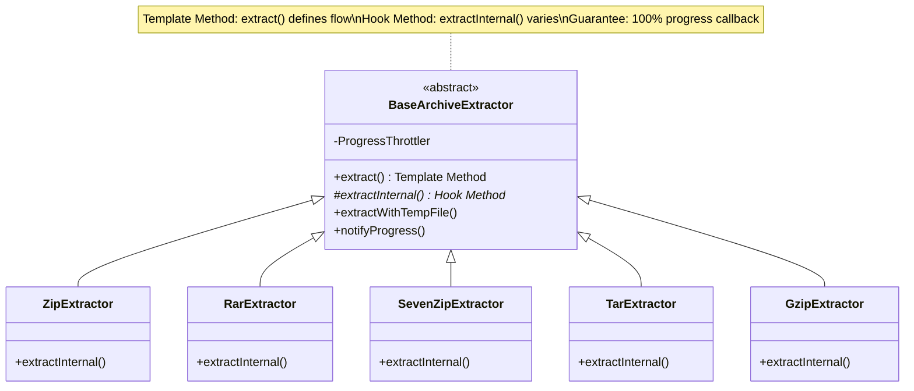
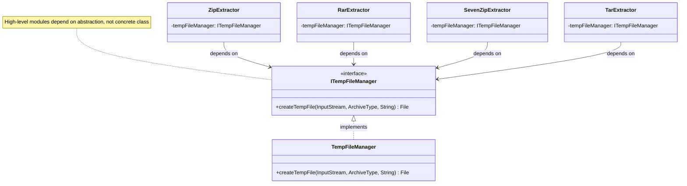

# Design Patterns - Otter

**Purpose**: Design patterns and SOLID principles applied in the Otter codebase
**Last Updated**: 2026-06-29

---

## Design Patterns Used

1. **MVVM** - Separation of UI and business logic
2. **Clean Architecture** - Layer independence (UI ↔ Domain ↔ Data)
3. **Repository Pattern** - Abstract data sources
4. **Use Case Pattern** - Single responsibility business operations
5. **Dependency Injection** - Loose coupling via Hilt
6. **Sealed Classes** - Type-safe state management
7. **Flow / callbackFlow** - Reactive real-time progress updates
8. **Unidirectional Data Flow** - Activity → Service → Use Case → Repository
9. **Template Method (BaseArchiveExtractor)** - DRY pattern for common extraction logic
10. **Strategy Pattern** - Multiple extractors (ZIP, RAR, 7z, TAR, GZIP, RPA) implementing same interface
11. **Foreground Service** - Background work with user-visible notifications
12. **Observer Pattern** - Progress callbacks with throttling

---

## SOLID Refactoring Patterns (Issue #15)

### Template Method Pattern

**Benefits**:
- Eliminates code duplication (common flow in base class)
- Guarantees final progress callback at 100% for all extractors
- Consistent error handling and cancellation support

---

### Strategy Pattern (Progress Calculation)

**Benefits**:
- Open-Closed Principle: add new strategies without modifying extractors
- Each strategy encapsulates one algorithm variant
- Easy to test independently

---

### Dependency Inversion Principle

**Benefits**:
- High-level extractors don't depend on concrete TempFileManager
- Easy to mock ITempFileManager for unit tests
- Can swap implementation without changing extractors

---

### Single Responsibility Principle (Class Extraction)

`BaseArchiveExtractor` (300+ LOC, too many responsibilities) was split into:
- `BaseArchiveExtractor` — Template Method only
- `TempFileManager` — Temp file management
- `ExtractionLogger` — Logging with throttling
- `SevenZipExtractorHelper` — 7-Zip extraction logic
- `ProgressCalculator` — Progress calculation strategies

---

**End of Design Patterns Documentation**
