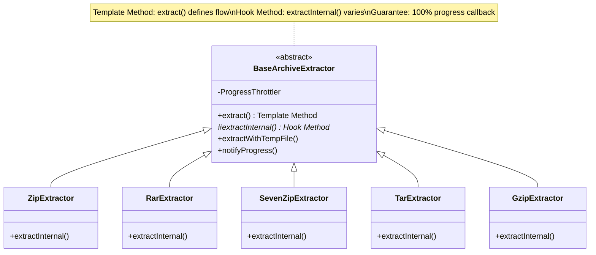
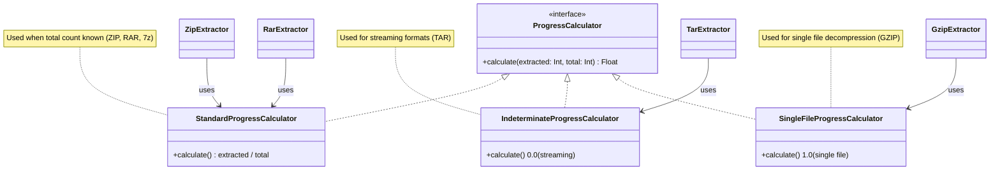

# Design Patterns - Otter

**Purpose**: Design patterns and SOLID principles applied in the Otter codebase
**Last Updated**: 2026-08-17

---

## Design Patterns Used

1. **MVVM** - Separation of UI and business logic
2. **Clean Architecture** - Layer independence (UI ↔ Domain ↔ Data)
3. **Repository Pattern** - Abstract data sources
4. **Use Case Pattern** - Single responsibility business operations
5. **Dependency Injection** - Loose coupling via Hilt
6. **Sealed Classes** - Type-safe state management
7. **Flow / callbackFlow** - Reactive real-time progress updates
8. **Unidirectional Data Flow** - Activity → Service → Use Case → Repository
9. **Template Method (BaseArchiveExtractor)** - DRY pattern for common extraction logic
10. **Strategy Pattern** - Multiple extractors (ZIP, RAR, 7z, TAR, GZIP, RPA) implementing same interface
11. **Foreground Service** - Background work with user-visible notifications
12. **Observer Pattern** - Progress callbacks with throttling
13. **Facade Pattern (BrowsingUseCases, ExtractionCoordinator)** - Group related dependencies to keep constructor parameter counts in check
14. **Property Delegate Singleton (Context.settingsDataStore)** - Guarantee a single DataStore instance per file across the process

---

## SOLID Refactoring Patterns (Issue #15)

### Template Method Pattern



**Benefits**:
- Eliminates code duplication (common flow in base class)
- Guarantees final progress callback at 100% for all extractors
- Consistent error handling and cancellation support

---

### Strategy Pattern (Progress Calculation)



**Benefits**:
- Open-Closed Principle: add new strategies without modifying extractors
- Each strategy encapsulates one algorithm variant
- Easy to test independently

---

### Dependency Inversion Principle


**Benefits**:
- High-level extractors don't depend on concrete TempFileManager
- Easy to mock ITempFileManager for unit tests
- Can swap implementation without changing extractors

---

### Single Responsibility Principle (Class Extraction)

`BaseArchiveExtractor` (300+ LOC, too many responsibilities) was split into:
- `BaseArchiveExtractor` — Template Method only
- `TempFileManager` — Temp file management
- `ExtractionLogger` — Logging with throttling
- `SevenZipExtractorHelper` — 7-Zip extraction logic
- `ProgressCalculator` — Progress calculation strategies

---

## Facade Pattern for Constructor Parameter Counts (Issue #37)

`FileBrowserViewModel`'s constructor grew past detekt's `LongParameterList` threshold as settings support was wired in. Rather than raising the threshold, related dependencies were grouped into facades:

```kotlin
data class BrowsingUseCases(
    val browseItems: BrowseItemsUseCase,
    val getFolderCounts: GetFolderCountsUseCase
)

data class ExtractionCoordinator(
    val eventBus: ExtractionEventBus,
    val extractionQueue: ExtractionQueue
)
```

**Benefits**:
- Reduces constructor parameter count without weakening the type system (`Any`, loose maps) or suppressing the lint rule
- Groups genuinely related collaborators — each facade answers "what does this ViewModel need to browse" / "what does it need to coordinate extraction", not an arbitrary bucket
- New settings-related dependencies (`SettingsRepository`) stayed as a direct constructor parameter rather than forcing them into an unrelated facade — grouping is by cohesion, not by "reduce the count at any cost"

---

## Property Delegate Singleton for DataStore (Issue #37)

A `@Provides` method that calls `PreferenceDataStoreFactory.create()` directly can produce two live `DataStore` instances backed by the same file if Hilt resolves the provider more than once in certain scopes, crashing with "There are multiple DataStores active for this file". Fixed via the standard Jetpack `preferencesDataStore` property delegate, which guarantees a single instance per file across the process:

```kotlin
private val Context.settingsDataStore: DataStore<Preferences> by preferencesDataStore(name = "user_settings")

@Provides
@Singleton
fun provideSettingsDataStore(@ApplicationContext context: Context): DataStore<Preferences> =
    context.settingsDataStore
```

**Benefits**:
- The delegate, not the DI container, owns instance uniqueness — safe regardless of how many times Hilt calls the provider
- Same pattern applies to any future DataStore-backed repository in the app

---

**End of Design Patterns Documentation**
