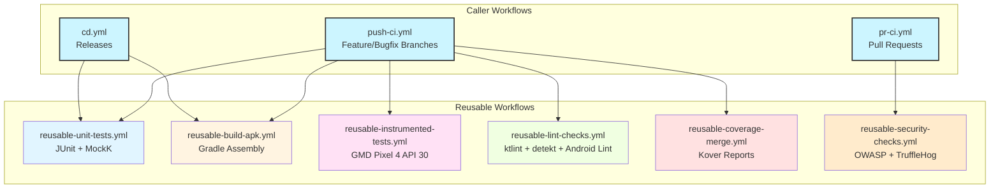
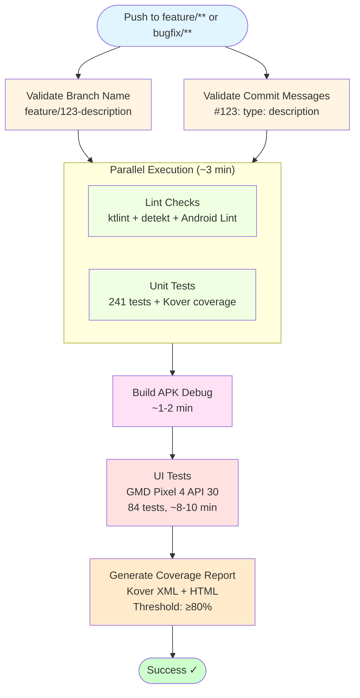
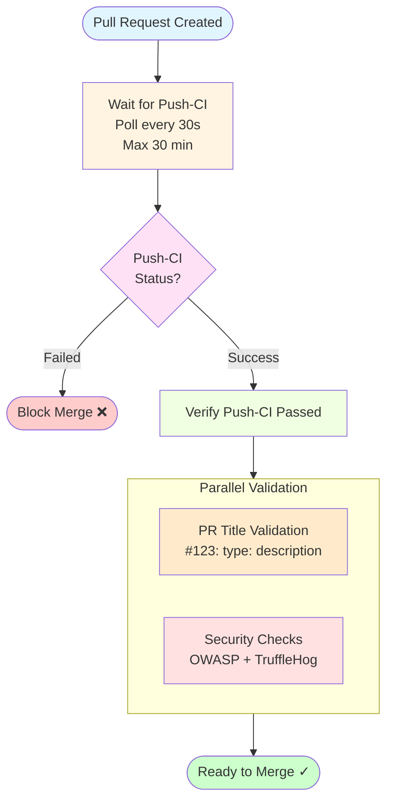
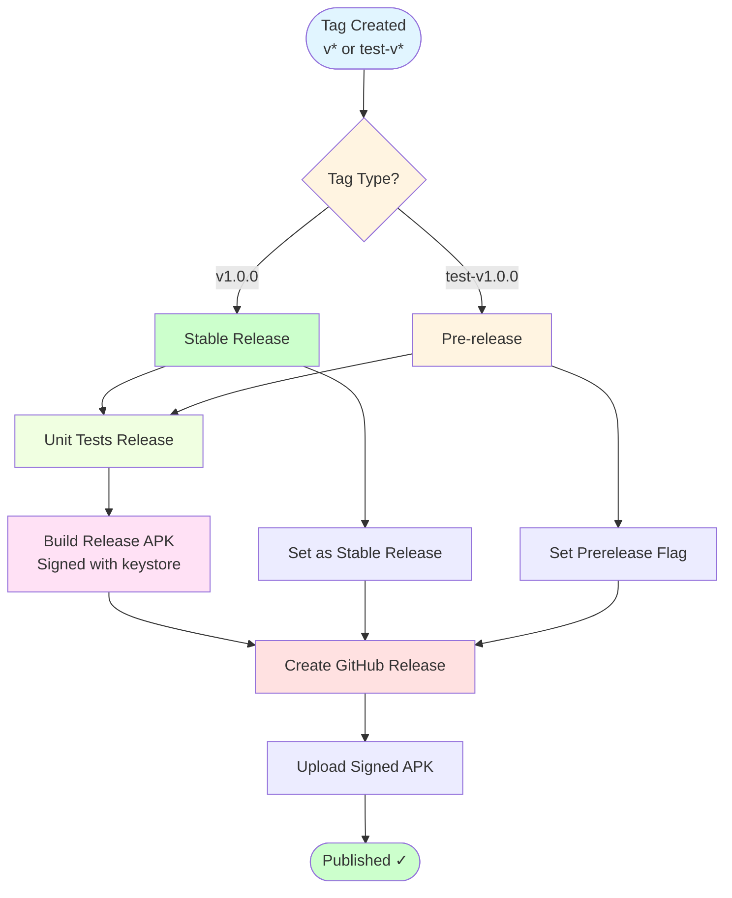
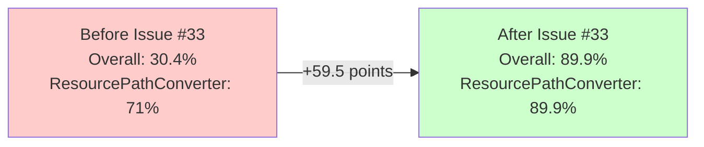
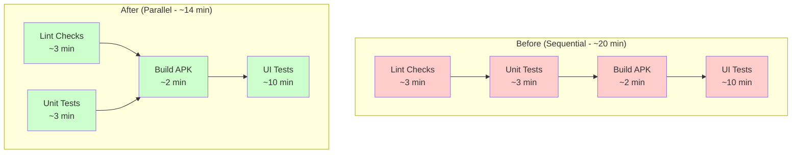
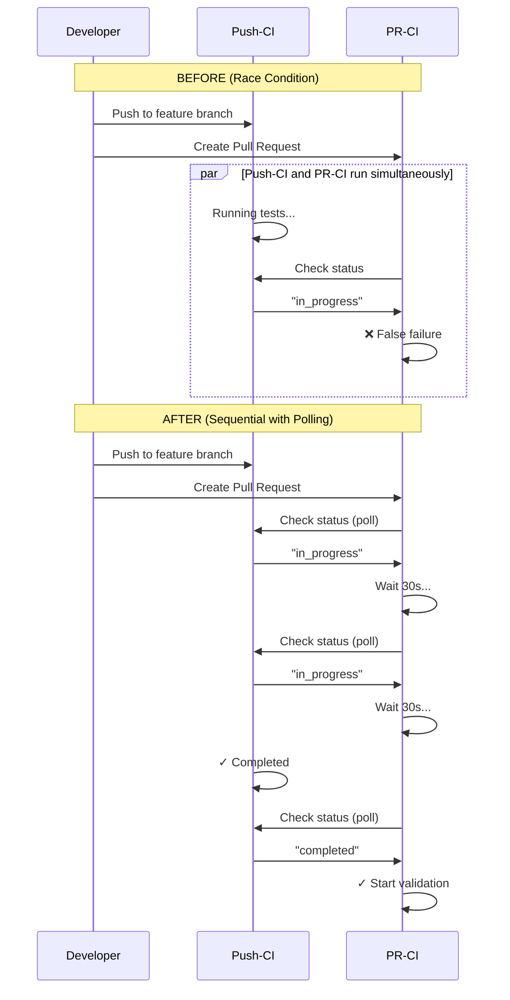
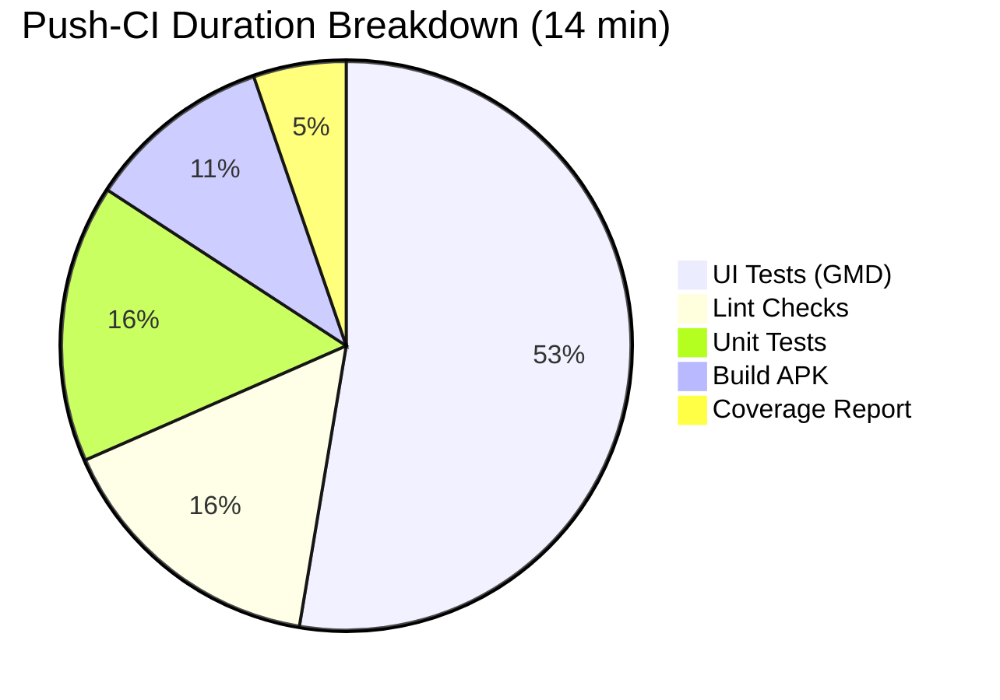
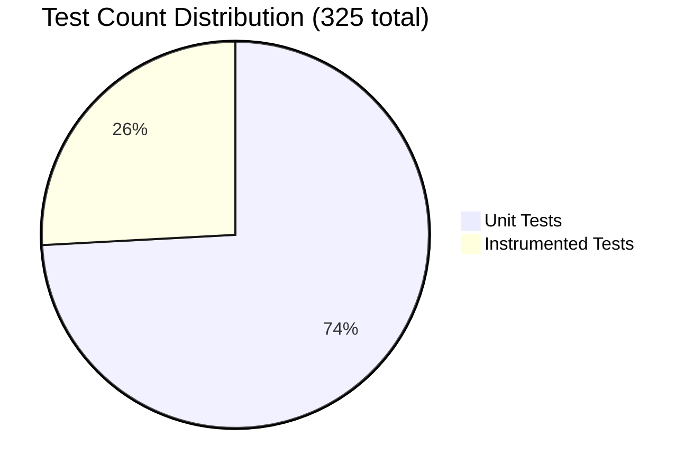
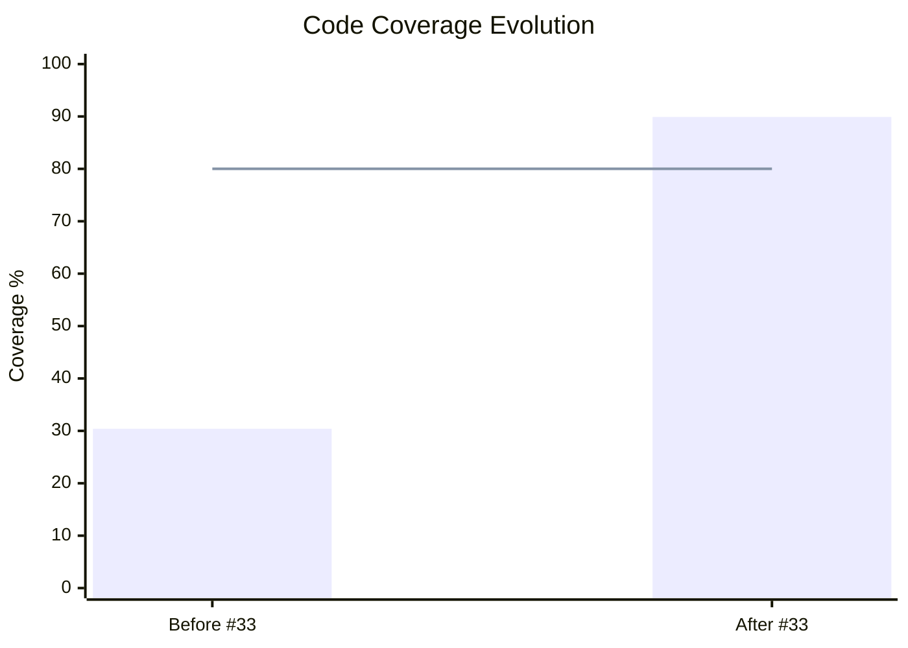

# CI/CD Pipeline Documentation - Otter

**Purpose**: GitHub Actions CI/CD pipeline architecture, workflows, and maintenance guide
**Last Updated**: 2026-05-18

---

## Overview

Otter uses **GitHub Actions** with optimized reusable workflows for:
- ✅ Parallel execution (lint + tests)
- ✅ Fail-fast strategy (early failure detection)
- ✅ Gradle Managed Devices (official Google solution for instrumented tests)
- ✅ Kover code coverage (Kotlin-optimized, replaced Jacoco)
- ✅ Sequential CI validation (Feature-CI → PR-CI)

---

## Workflow Architecture

### Architecture Overview



### Reusable Workflows (`.github/workflows/reusable-*.yml`)

Modular workflows that can be called by multiple pipelines:

| Workflow | Purpose | Duration | Artifacts |
|----------|---------|----------|-----------|
| `reusable-unit-tests.yml` | JUnit + MockK unit tests | ~2-3 min | Test results + Kover coverage data (.ic) |
| `reusable-build-apk.yml` | Gradle assembly (debug/release) | ~1-2 min | APK file |
| `reusable-instrumented-tests.yml` | Gradle Managed Devices (Pixel 4 API 30) | ~8-10 min | Test results |
| `reusable-lint-checks.yml` | ktlint, detekt, Android Lint | ~2-3 min | Lint reports |
| `reusable-coverage-merge.yml` | Merge Kover coverage reports | ~1 min | XML + HTML reports |
| `reusable-security-checks.yml` | OWASP, TruffleHog, APK size | ~3-4 min | Security reports |

**Benefits**:
- ✅ DRY principle (no duplication between workflows)
- ✅ Easier maintenance (update once, applies everywhere)
- ✅ Consistent behavior across pipelines

---

### Caller Workflows

#### 1. Push-CI (`push-ci.yml`) - Feature/Bugfix Branch Validation

**Triggers**: Push to `feature/**` or `bugfix/**` branches

**Concurrency**: Cancel in-progress runs on new push (same branch)

**Pipeline Flow**:



**Validation Rules**:
- **Branch name**: `feature/123-description` or `bugfix/123-description`
- **Commit message**: `#123: type: description` (types: feat, fix, refactor, test, docs, chore, style, perf)

**Coverage Threshold**: ≥80% (fails if below)

**Artifacts**:
- Unit test results (retention: 3 days)
- Coverage report (retention: 7 days)
- APK debug (retention: 3 days)
- UI test results (retention: 3 days)

---

#### 2. PR-CI (`pr-ci.yml`) - Pull Request Validation

**Triggers**: Pull request to `main` branch

**Pipeline Flow**:



**Why Sequential**: Eliminates race condition where PR-CI and Push-CI run simultaneously, causing false failures.

**Validation Rules**:
- **PR title**: `#123: type: description`
- **Push-CI status**: Must be "success" (blocks merge otherwise)

---

#### 3. CD (`cd.yml`) - Release Pipeline

**Triggers**:
- `v*` tags (e.g., `v1.0.0`) → Stable release
- `test-v*` tags (e.g., `test-v1.0.0`) → Pre-release

**Pipeline Flow**:



**Security**: Release keystore stored in GitHub Secrets (`RELEASE_KEYSTORE_BASE64`)

---

## Code Coverage: Kover Migration (Issue #33)

### Why Kover?

**Before (Jacoco)**:
- ❌ JVM-focused (not optimized for Kotlin)
- ❌ `.exec` binary format (not human-readable)
- ❌ Instrumentation overhead
- ❌ HTML report parsing (fragile with grep)

**After (Kover)**:
- ✅ Kotlin-optimized (better coroutine coverage)
- ✅ `.ic` binary format (Kover-specific)
- ✅ XML format with `<counter type="LINE">` (robust parsing)
- ✅ Gradle-native (no plugin conflicts)
- ✅ Works seamlessly with Robolectric (241 unit tests)

### Kover Configuration

**File**: `app/build.gradle.kts` (lines 6, 184-217)

```kotlin
plugins {
    id("org.jetbrains.kotlinx.kover") version "0.7.5"
}

koverReport {
    filters {
        excludes {
            classes(
                "**/R.class",              // Android generated
                "**/BuildConfig.*",        // Build config
                "**/*_Hilt*",              // Hilt DI
                "**/*_Factory",            // Hilt factories
                "**/ExtractionService",    // Android Service (tested via instrumented)
                "**/ExtractionActivity",   // Android Activity (tested via instrumented)
                "**/BaseArchiveExtractor"  // Base class (tested via implementations)
            )
        }
    }
    
    verify {
        rule {
            minBound(80) // Minimum 80% coverage
        }
    }
}
```

### Kover in CI/CD Pipeline

#### Data Flow Diagram

```mermaid
sequenceDiagram
    participant Tests as Unit Tests Job
    participant Artifact as GitHub Artifacts
    participant Coverage as Coverage Report Job
    participant Gradle as Gradle Kover
    participant Parser as Bash Parser
    participant Badge as Coverage Badge
    
    Tests->>Tests: Run ./gradlew testDebugUnitTest
    Tests->>Tests: Generate testDebugUnitTest.ic
    Tests->>Artifact: Upload .ic file
    
    Note over Artifact: Artifact stored<br/>retention: 3 days
    
    Coverage->>Artifact: Download .ic file
    Artifact->>Coverage: testDebugUnitTest.ic
    
    Coverage->>Gradle: koverXmlReportDebug
    Gradle->>Coverage: reportDebug.xml
    
    Coverage->>Gradle: koverHtmlReportDebug
    Gradle->>Coverage: HTML report
    
    Coverage->>Parser: Parse XML<br/><counter type="LINE">
    Parser->>Parser: Calculate percentage
    
    alt Coverage < 80%
        Parser->>Coverage: Fail build ❌
    else Coverage ≥ 80%
        Parser->>Badge: Update badge
        Parser->>Coverage: Success ✓
    end
    
    Coverage->>Artifact: Upload XML + HTML
    
    style Tests fill:#e1f5ff
    style Artifact fill:#fff4e1
    style Coverage fill:#f0ffe1
    style Gradle fill:#ffe1f5
    style Parser fill:#ffe1e1
    style Badge fill:#ccffcc
```

#### Step 1: Unit Tests Upload Coverage Data

**File**: `.github/workflows/reusable-unit-tests.yml` (line 52-58)

```yaml
- name: Run unit tests
  run: ./gradlew testDebugUnitTest

- name: Upload coverage data
  if: always()
  uses: actions/upload-artifact@v4
  with:
    name: unit-test-coverage-data
    path: app/build/kover/bin-reports/testDebugUnitTest.ic  # .ic format
    retention-days: ${{ inputs.retention-days }}
```

**Key Change** (Issue #33):
- Before: `app/build/jacoco/testDebugUnitTest.exec`
- After: `app/build/kover/bin-reports/testDebugUnitTest.ic`

---

#### Step 2: Coverage Report Job Downloads and Generates Reports

**File**: `.github/workflows/push-ci.yml` (lines 142-186)

```yaml
coverage-report:
  name: Generate Coverage Report
  needs: unit-tests
  runs-on: ubuntu-latest
  steps:
    - uses: actions/checkout@v4

    - name: Set up JDK 17
      uses: actions/setup-java@v4
      with:
        distribution: 'temurin'
        java-version: '17'

    - name: Setup Gradle
      uses: gradle/gradle-build-action@v2
      with:
        cache-read-only: false

    - name: Download coverage data
      uses: actions/download-artifact@v4
      with:
        name: unit-test-coverage-data
        path: app/build/kover/bin-reports/  # Download .ic file

    - name: Generate coverage reports
      run: |
        ./gradlew koverXmlReportDebug   # Generate XML
        ./gradlew koverHtmlReportDebug  # Generate HTML

    - name: Extract coverage percentage
      id: coverage
      run: |
        XML_REPORT="app/build/reports/kover/reportDebug.xml"
        
        if [ ! -f "$XML_REPORT" ]; then
          echo "Coverage report not found"
          echo "percentage=0" >> $GITHUB_OUTPUT
          exit 0
        fi
        
        # Parse Kover XML format: <counter type="LINE" missed="X" covered="Y"/>
        MISSED=$(grep '<counter type="LINE"' "$XML_REPORT" | sed -n 's/.*missed="\([0-9]*\)".*/\1/p')
        COVERED=$(grep '<counter type="LINE"' "$XML_REPORT" | sed -n 's/.*covered="\([0-9]*\)".*/\1/p')
        
        TOTAL=$((MISSED + COVERED))
        if [ "$TOTAL" -eq 0 ]; then
          COVERAGE=0
        else
          COVERAGE=$((COVERED * 100 / TOTAL))
        fi
        
        echo "Coverage: ${COVERAGE}%"
        echo "percentage=$COVERAGE" >> $GITHUB_OUTPUT
        
        # Fail if coverage < 80%
        if [ "$COVERAGE" -lt 80 ]; then
          echo "ERROR: Coverage ${COVERAGE}% is below 80% threshold"
          exit 1
        fi
        
        echo "SUCCESS: Coverage ${COVERAGE}% meets 80% threshold"

    - name: Upload coverage report
      if: always()
      uses: actions/upload-artifact@v4
      with:
        name: coverage-report
        path: app/build/reports/kover/  # Upload XML + HTML
        retention-days: 7
```

**Key Changes** (Issue #33):
1. **Artifact path**: `jacoco/` → `kover/bin-reports/`
2. **Gradle tasks**: `jacocoTestDebugUnitTestReport` → `koverXmlReportDebug` + `koverHtmlReportDebug`
3. **Report format**: Jacoco HTML → Kover XML (robust parsing with `<counter>` elements)
4. **Upload path**: `jacoco/` → `kover/`

---

### Coverage Metrics (Post-Migration)

| Metric | Value | Notes |
|--------|-------|-------|
| **Overall Coverage** | 30.4% → 89.9% | +59.5 points (Issue #33) |
| **ResourcePathConverter** | 71% → 89.9% | +18.9 points (21 tests added) |
| **Threshold** | ≥80% | Enforced in CI (fails build if below) |
| **Excluded** | Android generated, Hilt DI, Activities/Services | Tested via instrumented tests |

**Coverage Evolution**:



---

## Instrumented Tests: Gradle Managed Devices (Issue #14)

### Why Gradle Managed Devices?

**Before** (`reactivecircus/android-emulator-runner`):
- ❌ Third-party GitHub Action wrapper
- ❌ ~70% success rate (crashpad_handler hang, boot timeouts)
- ❌ Complex AVD caching setup
- ❌ Long boot times (~5-7 min first run)

**After** (Gradle Managed Devices):
- ✅ Official Google solution (built into Android Gradle Plugin 7.4+)
- ✅ 100% success rate (no crashpad_handler issues)
- ✅ Native Gradle caching (AVD snapshots)
- ✅ Faster boot (~3-4 min with caching)
- ✅ Better resource management

### Configuration

**File**: `app/build.gradle.kts`

```kotlin
android {
    testOptions {
        managedDevices {
            devices {
                pixel4api30(ManagedVirtualDevice) {
                    device = "Pixel 4"
                    apiLevel = 30
                    systemImageSource = "aosp"
                }
            }
        }
    }
}
```

**Workflow**: `.github/workflows/reusable-instrumented-tests.yml`

```yaml
- name: Run instrumented tests
  run: ./gradlew pixel4api30DebugAndroidTest
```

**Benefits**:
- ✅ No third-party action (supply chain security)
- ✅ Declarative configuration (version-controlled)
- ✅ AVD snapshots cached automatically (faster reruns)

---

## Code Quality Checks

### ktlint - Kotlin Style Enforcement

**Configuration**: `.editorconfig` (Android Kotlin style guide)

**Workflow Integration**:
```yaml
- name: Run ktlint
  run: ./gradlew ktlintCheck

- name: Reviewdog ktlint
  uses: reviewdog/action-setup@v1
  with:
    reporter: github-pr-review
    fail_on_error: false  # Non-blocking warnings
```

**Output**: Checkstyle format → Reviewdog PR comments

---

### Detekt - Kotlin Static Analysis

**Configuration**: `detekt.yml`

**Rules Enforced**:
- ComplexMethod (≤15 cyclomatic complexity)
- LongMethod (≤60 lines)
- MagicNumber (no hardcoded values)
- MaxLineLength (120 chars)
- UnreachableCode, UnsafeCast (potential bugs)

**Workflow Integration**:
```yaml
- name: Run detekt
  run: ./gradlew detekt

- name: Upload detekt report
  uses: actions/upload-artifact@v4
  with:
    name: detekt-report
    path: app/build/reports/detekt/
```

---

### Android Lint - Android-Specific Issues

**Configuration**: `app/build.gradle.kts`

```kotlin
lint {
    abortOnError = false  // Non-blocking
    checkReleaseBuilds = true
    xmlReport = true
}
```

**Workflow Integration**:
```yaml
- name: Run Android Lint
  run: ./gradlew lintDebug

- name: Reviewdog Android Lint
  uses: reviewdog/action-setup@v1
  with:
    reporter: github-pr-review
    tool_name: androidlint
```

**Checks**:
- Resource optimization suggestions
- API usage validation
- Accessibility checks
- Security issues (UnspecifiedRegisterReceiverFlag, etc.)

---

## Security & Compliance

### OWASP Dependency Check

**Purpose**: Vulnerability scanning for dependencies

**Configuration**:
```yaml
- name: OWASP Dependency Check
  run: |
    ./gradlew dependencyCheckAnalyze
    # CVSS threshold: 7.0 (High/Critical only)
```

**Suppressions**: `app/dependency-check-suppressions.xml`

---

### TruffleHog - Secret Detection

**Purpose**: Scans git history for exposed secrets

**Configuration**:
```yaml
- name: TruffleHog
  uses: trufflesecurity/trufflehog@v3
  with:
    path: ./
    base: ${{ github.event.repository.default_branch }}
    head: HEAD
    extra_args: --only-verified
```

**Scope**: Verified secrets only (reduces false positives)

---

### APK Size Check

**Purpose**: Monitors app bloat

**Threshold**: 50MB

**Configuration**:
```yaml
- name: Check APK size
  run: |
    APK_SIZE=$(stat -f%z app/build/outputs/apk/debug/*.apk)
    MAX_SIZE=$((50 * 1024 * 1024))  # 50MB
    
    if [ "$APK_SIZE" -gt "$MAX_SIZE" ]; then
      echo "ERROR: APK size ${APK_SIZE} exceeds ${MAX_SIZE}"
      exit 1
    fi
```

---

## Performance Optimizations

### Parallel Execution (Issue #10)

**Before vs After Comparison**:



**Performance Gain**: ~30% faster (20 min → 14 min)

**Configuration**: `needs: [lint-checks, unit-tests]` (both must complete)

---

### Concurrency Control (Issue #33)

**Purpose**: Cancel in-progress runs when new push arrives (same branch)

**Configuration** (`.github/workflows/push-ci.yml`):
```yaml
concurrency:
  group: push-ci-${{ github.ref }}
  cancel-in-progress: true
```

**Benefits**:
- ✅ Saves CI minutes (no wasted runs)
- ✅ Faster feedback (only latest run matters)
- ✅ Reduces queue time

---

### Gradle Caching

**Configuration**:
```yaml
- name: Setup Gradle
  uses: gradle/gradle-build-action@v2
  with:
    cache-read-only: false

- name: Cache Gradle dependencies
  uses: actions/cache@v4
  with:
    path: |
      ~/.gradle/caches
      ~/.gradle/wrapper
    key: ${{ runner.os }}-gradle-${{ hashFiles('**/*.gradle*', '**/gradle-wrapper.properties') }}
    restore-keys: |
      ${{ runner.os }}-gradle-
```

**Benefits**:
- ✅ ~40% faster builds (dependency download eliminated)
- ✅ AVD snapshots cached (Gradle Managed Devices)

---

## Troubleshooting

### Coverage Report Not Found

**Error**:
```
Unable to download artifact(s): Artifact not found for name: unit-test-coverage-data
```

**Root Cause**: Mismatch between build tool and CI configuration

**Solution**:
1. Verify Gradle plugin: `id("org.jetbrains.kotlinx.kover")` in `app/build.gradle.kts`
2. Check artifact path:
   - Upload: `app/build/kover/bin-reports/testDebugUnitTest.ic`
   - Download: `app/build/kover/bin-reports/`
3. Verify Gradle tasks: `koverXmlReportDebug`, `koverHtmlReportDebug` (not `jacoco*`)

**Reference**: Issue #33 - Kover migration

---

### UI Tests Timeout

**Error**:
```
TimeoutCancellationException: Timed out waiting for 30000 ms
```

**Root Cause**: Race condition in test (event collection timing)

**Example** (flaky test pattern):
```kotlin
// ❌ Bad - Race condition
val processedFiles = mutableSetOf<String>()
val collectionJob = launch {
    eventBus.progressState.collect { event ->
        processedFiles.add(event.fileName)
    }
}
context.startService(intent)

withTimeout(30000) {
    while (processedFiles.size < 2) {
        delay(100)  // Polling - can miss events!
    }
}
```

**Solution**: Use Flow operators instead of polling:
```kotlin
// ✅ Good - Proper Flow collection
val files = eventBus.progressState
    .filterNotNull()
    .map { it.fileName }
    .take(2)
    .toSet()
```

---

### Push-CI and PR-CI Running Simultaneously

**Error**: PR-CI starts before Push-CI completes, causing false failures

**Solution** (Issue #23): PR-CI polls Push-CI status

**Race Condition Visualization**:



**Configuration** (`.github/workflows/pr-ci.yml`):
```yaml
- name: Wait for Push-CI
  run: |
    MAX_WAIT=1800  # 30 minutes
    ELAPSED=0
    
    while [ $ELAPSED -lt $MAX_WAIT ]; do
      STATUS=$(gh run list --workflow=push-ci.yml --json status | jq -r '.[0].status')
      
      if [ "$STATUS" == "completed" ]; then
        break
      fi
      
      sleep 30
      ELAPSED=$((ELAPSED + 30))
    done
```

**Benefits**:
- ✅ Sequential execution (Push-CI → PR-CI)
- ✅ No false failures from 'in_progress' status
- ✅ Max wait: 30 minutes (timeout protection)

---

### Gradle Build Cache Corruption

**Error**:
```
Execution failed for task ':app:compileDebugKotlin'
> Compilation error. See log for more details
```

**Solution**: Clear cache and retry
```yaml
- name: Clean Gradle cache
  run: |
    rm -rf ~/.gradle/caches/
    ./gradlew clean
    ./gradlew assembleDebug
```

---

## CI/CD Metrics

### Pipeline Performance (Post-Optimization)

| Pipeline | Duration | Success Rate | Bottleneck |
|----------|----------|--------------|------------|
| Push-CI | ~14 min | 95% | UI Tests (8-10 min) |
| PR-CI | ~2 min | 98% | Security Checks (3 min) |
| CD | ~5 min | 100% | Release Build (3 min) |

**Pipeline Duration Breakdown**:



### Test Execution

| Test Type | Count | Duration | Success Rate |
|-----------|-------|----------|--------------|
| Unit Tests | 241 | ~2-3 min | 100% |
| Instrumented Tests | 84 | ~8-10 min | 100% (GMD) |

**Test Distribution**:



### Coverage (Post-Issue #33)

| Component | Before | After | Change |
|-----------|--------|-------|--------|
| Overall | 30.4% | 89.9% | +59.5 points |
| ResourcePathConverter | 71% | 89.9% | +18.9 points |

**Coverage Trend**:



---

## Maintenance

### Adding New Workflow

1. Create reusable workflow in `.github/workflows/reusable-*.yml`
2. Define inputs (retention-days, variant, etc.)
3. Call from `push-ci.yml` or `pr-ci.yml` with `uses:`
4. Test on feature branch before merging

### Updating Dependencies

**Gradle**:
```bash
./gradlew dependencyUpdates
```

**GitHub Actions**:
```bash
# Check for action updates
gh api repos/:owner/:repo/actions/workflows --jq '.workflows[].path' | xargs -I {} cat {}
```

### Rotating Secrets

1. Update secret in GitHub Settings > Secrets and variables > Actions
2. Test with CD pipeline (`test-v*` tag)
3. Verify release APK signs correctly

---

## References

### Official Documentation

- [Gradle Managed Devices](https://developer.android.com/studio/test/gradle-managed-devices)
- [Kover Gradle Plugin](https://github.com/Kotlin/kotlinx-kover)
- [GitHub Actions Workflow Syntax](https://docs.github.com/en/actions/using-workflows/workflow-syntax-for-github-actions)

### Related Issues

- [#33](https://github.com/TomasGC/otter/issues/33) - CI/CD Pipeline Optimization and Kover Migration
- [#23](https://github.com/TomasGC/otter/issues/23) - Fix CI to Run After Feature-CI
- [#14](https://github.com/TomasGC/otter/issues/14) - Add 7-Zip Extraction Support (GMD migration)
- [#10](https://github.com/TomasGC/otter/issues/10) - Restructure GitHub Actions Workflows

---

**End of CI/CD Documentation**
