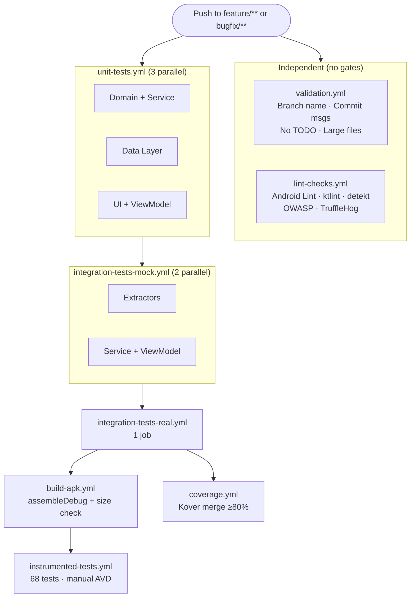
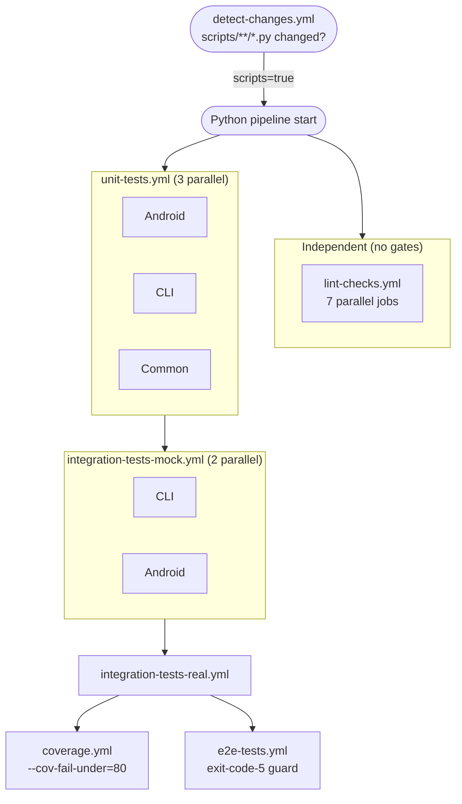
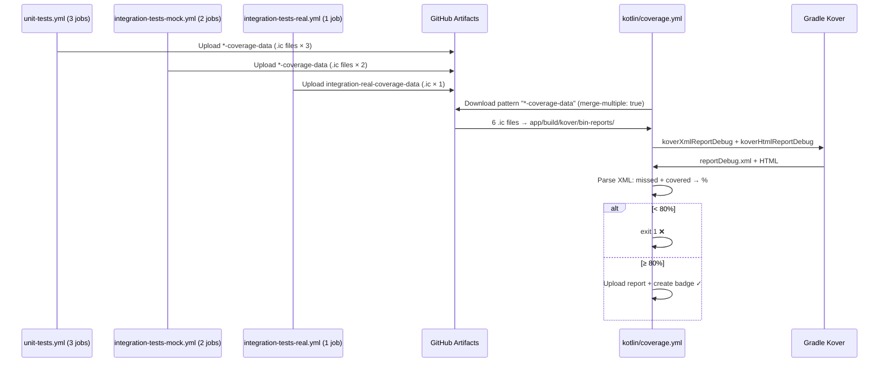

# CI/CD Pipeline Documentation - Otter

**Purpose**: GitHub Actions CI/CD pipeline architecture, workflows, and maintenance guide
**Last Updated**: 2026-06-11

---

## Overview

Otter uses **GitHub Actions** with a grouped reusable workflow architecture split into two sub-pipelines:

- ✅ **Kotlin pipeline** — always runs on push to feature/bugfix branches
- ✅ **Python pipeline** — conditional, runs only when `scripts/**/*.py` changed
- ✅ **Parallel execution** — lint/validation independent from tests (maximum progression)
- ✅ **Fail-forward strategy** — lint/validation failures don't block tests; all blocks are blocking
- ✅ **Kover code coverage** (Kotlin-optimized, replaces Jacoco)
- ✅ **Event-driven PR validation** (Push-CI completes → PR-CI triggers via `workflow_run`)
- ✅ **Pinned third-party actions** (SHA-pinned, supply chain hardened)

---

## Workflow Architecture

### Folder Structure

```
.github/workflows/
├── push-ci.yml                          # Trigger: feature/** + bugfix/** branches
├── pr-ci.yml                            # Trigger: workflow_run (after Push-CI)
├── cd.yml                               # Trigger: v* / test-v* tags
├── reusable-security-checks.yml         # Called by pr-ci.yml
├── kotlin/
│   ├── kotlin.yml                       # Kotlin sub-orchestrator
│   ├── validation.yml                   # Branch name, commit msgs, TODO check, large files
│   ├── lint-checks.yml                  # Android lint, ktlint, detekt, OWASP, TruffleHog
│   ├── unit-tests.yml                   # 3 parallel jobs (domain+service, data, ui)
│   ├── integration-tests-mock.yml       # 2 parallel jobs (extractors, service+viewmodel)
│   ├── integration-tests-real.yml       # 1 job (real archives, zero mocks)
│   ├── build-apk.yml                    # Debug APK + size check (≤50MB)
│   ├── coverage.yml                     # Kover merge, ≥80% threshold, badge
│   └── instrumented-tests.yml           # Manual AVD + connectedDebugAndroidTest
└── python/
    ├── python.yml                       # Python sub-orchestrator
    ├── detect-changes.yml               # dorny/paths-filter for scripts/**/*.py
    ├── unit-tests.yml                   # 3 parallel jobs (android, cli, common)
    ├── lint-checks.yml                  # 7 parallel: flake8, black+isort, pylint, mypy, bandit, pip-audit, vulture
    ├── integration-tests-mock.yml       # 2 parallel jobs (cli, android)
    ├── integration-tests-real.yml       # 1 job (real subprocess)
    ├── coverage.yml                     # unit + mock + real, --cov-fail-under=80
    └── e2e-tests.yml                    # Exit-code-5 guard (no tests yet)
```

---

### Architecture Overview

```mermaid
graph TB
    subgraph "Trigger Workflows (repo root)"
        PushCI[push-ci.yml<br/>feature/** bugfix/**]
        PRCI[pr-ci.yml<br/>workflow_run]
        CD[cd.yml<br/>v* tags]
    end

    subgraph "Sub-Orchestrators"
        Kotlin[kotlin/kotlin.yml]
        Python[python/python.yml]
        DetectChanges[python/detect-changes.yml]
    end

    subgraph "Kotlin Reusable Workflows"
        KVal[kotlin/validation.yml]
        KLint[kotlin/lint-checks.yml]
        KUnit[kotlin/unit-tests.yml]
        KMock[kotlin/integration-tests-mock.yml]
        KReal[kotlin/integration-tests-real.yml]
        KBuild[kotlin/build-apk.yml]
        KCov[kotlin/coverage.yml]
        KInstr[kotlin/instrumented-tests.yml]
    end

    subgraph "Python Reusable Workflows"
        PUnit[python/unit-tests.yml]
        PLint[python/lint-checks.yml]
        PMock[python/integration-tests-mock.yml]
        PReal[python/integration-tests-real.yml]
        PCov[python/coverage.yml]
        PE2E[python/e2e-tests.yml]
    end

    PushCI --> DetectChanges
    PushCI --> Kotlin
    PushCI -->|if scripts changed| Python

    Kotlin --> KVal
    Kotlin --> KLint
    Kotlin --> KUnit
    Kotlin --> KMock
    Kotlin --> KReal
    Kotlin --> KBuild
    Kotlin --> KCov
    Kotlin --> KInstr

    Python --> PUnit
    Python --> PLint
    Python --> PMock
    Python --> PReal
    Python --> PCov
    Python --> PE2E

    PRCI --> reusable-security-checks.yml
    CD --> KUnit
```



---

### Caller Workflows

#### 1. Push-CI (`push-ci.yml`) — Feature/Bugfix Branch Validation

**Triggers**: Push to `feature/**` or `bugfix/**`

**Concurrency**: Cancel in-progress on new push (same branch)

**Jobs**:
1. `detect-changes` — calls `python/detect-changes.yml`, outputs `scripts=true/false`
2. `kotlin-pipeline` — always runs, calls `kotlin/kotlin.yml` with `secrets: inherit`
3. `python-pipeline` — runs only if `scripts=true`, calls `python/python.yml`

---

#### 2. PR-CI (`pr-ci.yml`) — Pull Request Validation

**Triggers**: `workflow_run` — fires when Push-CI completes (not `pull_request`)

**Why event-driven**:
- Starts only after Push-CI **finished** — no race condition, no polling
- `conclusion != 'success'` → entire workflow skipped immediately
- No open PR for the branch → skipped

**Jobs**:
- `check-pr-exists` — verifies open PR targeting `main`
- `pr-validation` — PR title format check (`#123: type: description`)
- `context-check` — validates `.claude/contexts/kanban.md` updated when `app/src/` changed
- `context-comment` — posts PR comment if context files missing
- `security-checks` — calls `reusable-security-checks.yml` (OWASP + TruffleHog)

**Security hardening**:
- Injection fix: PR title via `env:` block — not interpolated in shell
- Privilege separation: `context-check` has `contents: read` only; `context-comment` has `pull-requests: write` but no checkout

---

#### 3. CD (`cd.yml`) — Release Pipeline

**Triggers**: `v*` tags (stable release) or `test-v*` tags (pre-release)

**Flow**: Unit Tests → Build Release APK (signed) → Create GitHub Release → Upload APK

**Security**: Release keystore in GitHub Secrets (`RELEASE_KEYSTORE_BASE64`)

---

## Kotlin Pipeline

### Flow Diagram



**Key design**:
- Validation and lint run **independently** — failures don't block tests
- Each block **is blocking** — failed block = failed pipeline
- `integration-mock` waits only for `unit-tests` (not lint/validation)
- `coverage` needs `integration-real` (all 6 `.ic` artifacts must exist)

### Validation Checks (`kotlin/validation.yml`)

| Job | Check | Rule |
|-----|-------|------|
| Branch Name | `grep -qE '^(feature\|bugfix)/[0-9]+-[a-zA-Z0-9_-]+'` | `feature/123-desc` or `bugfix/123-desc` |
| Commit Messages | git log format | `#123: type: description` |
| No TODO | `grep -rn --include="*.kt" -E "\b(TODO\|FIXME)\b" app/src/` | Zero matches |
| Large Files | `find . -not .git -not build -not *.jar/.so/.aar -size +500k` | Zero matches |

### Lint Checks (`kotlin/lint-checks.yml`)

| Job | Tool | Behavior |
|-----|------|----------|
| Android Lint | `./gradlew lintDebug` | Blocking |
| Kotlin Style | `ktlint` via reviewdog (SHA-pinned) | Non-blocking output (advisory), blocking job |
| Kotlin Quality | `./gradlew detekt` | Blocking |
| Dependencies | `./gradlew dependencyCheckAnalyze` (timeout: 20 min) | Blocking — add `NVD_API_KEY` secret to avoid rate limits |
| Secrets | `trufflesecurity/trufflehog` (SHA-pinned), `--only-verified` | Blocking |

**Permissions**: `contents: read` at workflow level (all jobs restricted)

### Unit Tests (`kotlin/unit-tests.yml`)

3 parallel jobs, each: checkout → JDK17 → Gradle → Python 3.11 → generate archive template → create RPA archive → `./gradlew testDebugUnitTest -DtestType=<type>`

| Job | `-DtestType` | Artifact |
|-----|-------------|----------|
| Domain + Service | `unit-domain-service` | `unit-domain-service-coverage-data` |
| Data Layer | `unit-data` | `unit-data-coverage-data` |
| UI + ViewModel | `unit-ui` | `unit-ui-coverage-data` |

**Why archive generation before tests**: Data layer tests and integration tests load real archive files from `archives/` (gitignored). `generate_archive_template.py` creates the template, `create_test_archives.py --rpa-only` creates `test_archive.rpa`.

### Integration Tests Mock (`kotlin/integration-tests-mock.yml`)

2 parallel jobs, same archive generation setup:

| Job | `-DtestType` | Artifact |
|-----|-------------|---------|
| Extractors | `integration-mock-extractor` | `integration-mock-extractor-coverage-data` |
| Service + ViewModel | `integration-mock-other` | `integration-mock-other-coverage-data` |

### Integration Tests Real (`kotlin/integration-tests-real.yml`)

1 job, `-DtestType=integration-real`, artifact: `integration-real-coverage-data`

Zero mocks — real archive files, real Kotlin code.

### Build APK (`kotlin/build-apk.yml`)

1. `./gradlew assembleDebug`
2. APK size check: fails if ≥50MB (`du -k` → integer division)
3. Uploads `debug-apk` artifact

### Coverage (`kotlin/coverage.yml`)

1. Downloads all `*-coverage-data` artifacts (pattern matches all 6 `.ic` files) with `merge-multiple: true`
2. Generates archive template (needed for Kover compilation)
3. `./gradlew koverXmlReportDebug && ./gradlew koverHtmlReportDebug`
4. Parses XML: `grep '<counter type="LINE"'` → `missed` + `covered` → `%`
5. Fails if `COVERED * 100 / TOTAL < 80`
6. Uploads coverage report artifact
7. Creates coverage badge if `COVERAGE_GIST_ID` secret configured

**`continue-on-error: true`** on artifact download: allows coverage to run even if some jobs failed (will then fail on 0 lines check).

### Instrumented Tests (`kotlin/instrumented-tests.yml`)

Manual AVD management (more control than Gradle Managed Devices alone):

1. Generate test archives including ZIP (inline Python script)
2. Enable KVM
3. `./gradlew pixel4api30Setup` — installs system image (GMD task)
4. `avdmanager create avd` — Pixel 4 API 30, 8GB data partition
5. Start emulator (`-no-snapshot-load -no-audio -no-boot-anim -gpu swiftshader_indirect`)
6. Wait for boot (`adb wait-for-device` + `sys.boot_completed`)
7. Disable animations (stability)
8. Push test archives to `/storage/emulated/0/otter-test-archives/`
9. `./gradlew connectedDebugAndroidTest`

**Timeout**: 75 minutes total

---

## Python Pipeline

### Flow Diagram



### Change Detection (`python/detect-changes.yml`)

Uses `dorny/paths-filter@v3`:

```yaml
filters: |
  scripts:
    - 'scripts/**/*.py'
    - 'scripts/pytest.ini'
    - 'scripts/requirements-test.txt'
```

Output: `scripts=true/false` → consumed by `push-ci.yml` `if:` condition.

### Unit Tests (`python/unit-tests.yml`)

3 parallel jobs, `working-directory: scripts`, Python 3.12:

| Job | Command |
|-----|---------|
| Android | `pytest tests/unit/android/ --no-cov -q` |
| CLI | `pytest tests/unit/cli/ --no-cov -q` |
| Common | `pytest tests/unit/common/ --no-cov -q` |

### Lint Checks (`python/lint-checks.yml`)

7 parallel jobs, all **blocking**:

| Job | Tool | Command |
|-----|------|---------|
| Python Lint | `flake8` | `flake8 src/ tests/ --max-line-length=120 --statistics` |
| Style Checks | `black` + `isort` | `black --check --line-length=120` + `isort --check --profile=black` |
| Quality | `pylint` | `pylint src/ tests/ --fail-under=7.0 --disable=C0114,C0115,C0116` (+ `requirements-test.txt` installed) |
| Type Checks | `mypy` | `mypy src/ --ignore-missing-imports --no-error-summary` |
| Security | `bandit` | `bandit -r src/ -ll -q` |
| Vulnerabilities | `pip-audit` | `pip-audit` (after installing `requirements-test.txt`) |
| Dead Code | `vulture` | `vulture src/ tests/ --min-confidence=80` |

**Note**: `pylint` installs `requirements-test.txt` in addition to `pylint` itself — prevents false `E0401 import-error` failures.

### Integration Tests (`python/integration-tests-mock.yml` + `real`)

Mock: 2 parallel jobs (`tests/integration_mock/cli/` + `tests/integration_mock/android/`)

Real: 1 job (`tests/integration_real/`) — real subprocess, no `FakeSubprocessRunner`

### Coverage (`python/coverage.yml`)

Covers all 3 tiers:

```bash
python -m pytest tests/unit/ tests/integration_mock/ tests/integration_real/ \
  --cov=src --cov-report=term-missing --cov-fail-under=80 -q
```

No XML parsing — `pytest-cov` built-in threshold enforcement.

### E2E Tests (`python/e2e-tests.yml`)

Exit-code-5 guard (no test collection = no tests yet, not a failure):

```bash
set +e
python -m pytest tests/e2e/ --no-cov -q
STATUS=$?
set -e
[ $STATUS -eq 5 ] && echo "No e2e tests yet" && exit 0 || exit $STATUS
```

---

## Code Coverage: Kover

### Why Kover?

| | Jacoco (before) | Kover (after) |
|--|----------------|---------------|
| Language | JVM-focused | Kotlin-optimized |
| Format | `.exec` binary | `.ic` binary |
| XML parsing | Fragile HTML grep | Robust `<counter type="LINE">` |
| Coroutine coverage | Poor | Accurate |
| Gradle integration | Plugin conflicts | Native |

### Kover Configuration

**File**: `app/build.gradle.kts`

```kotlin
plugins {
    id("org.jetbrains.kotlinx.kover") version "0.7.5"
}

koverReport {
    filters {
        excludes {
            classes(
                "**/R.class",
                "**/BuildConfig.*",
                "**/*_Hilt*",
                "**/*_Factory",
                "**/ExtractionService",    // Tested via instrumented
                "**/ExtractionActivity",   // Tested via instrumented
                "**/BaseArchiveExtractor"  // Tested via implementations
            )
        }
    }
    verify {
        rule { minBound(80) }
    }
}
```

### Coverage Data Flow



---

## Security Hardening

### SHA-Pinned Actions

All third-party actions pinned to full commit SHA (prevents supply chain attacks from mutable tags):

| Action | Tag | SHA |
|--------|-----|-----|
| `reviewdog/action-setup` | v1.3.0 | `3f401fe1d58fe77e10d665ab713057375e39b887` |
| `trufflesecurity/trufflehog` | v3 | `a05cf0859455b5b16317ed35d3cea0a7b1d3e3fa` |
| `schneegans/dynamic-badges-action` | v1.7.0 | `e9a478b16159b4d31420099ba146cdc50f134483` |

**Maintenance**: Add `package-ecosystem: github-actions` in Dependabot config to keep SHAs updated.

### OWASP Dependency Check

`./gradlew dependencyCheckAnalyze` — blocking, timeout 20 min.

Add `NVD_API_KEY` secret in Settings → Secrets → Actions to avoid NVD rate limits on first run (without key: very slow or fails with HTTP 403).

Suppressions: `app/dependency-check-suppressions.xml`

### TruffleHog

SHA-pinned, `--only-verified` (reduces false positives), `fetch-depth: 0` (full history scan).

---

## CI/CD Metrics

### Test Counts

| Category | Count | Runner |
|----------|-------|--------|
| **Kotlin unit (JVM)** | 439 | JUnit + MockK |
| **Kotlin integration mock** | 94 | JUnit + real files |
| **Kotlin integration real** | 2 | JUnit, no mocks |
| **Kotlin instrumented** | 68 | AndroidJUnit4 + Hilt |
| **Kotlin total** | **603** | |
| **Python unit** | ~290 | pytest |
| **Python integration mock** | 39 | pytest + real FS |
| **Python integration real** | 17 | pytest + real subprocess |
| **Python total** | **~370** | 98.1% coverage |

### Pipeline Performance

| Pipeline | Typical Duration | Bottleneck |
|----------|-----------------|------------|
| Push-CI (Kotlin) | ~20-25 min | Instrumented tests (~10 min) |
| Push-CI (Python) | ~5 min | Integration real |
| PR-CI | ~2 min | Security checks |
| CD | ~5 min | Release build |

### Coverage

| Language | Tool | Threshold | Current |
|----------|------|-----------|---------|
| Kotlin | Kover | ≥80% | ~89.9% |
| Python | pytest-cov | ≥80% | ~98.1% |

---

## Troubleshooting

### Coverage Report Not Found

**Error**: `Artifact not found for name: *-coverage-data`

**Causes**:
- A unit or integration job failed before uploading artifact
- `coverage.yml` has `continue-on-error: true` on download — will then fail with "No coverage data (0 lines)"

**Solution**: Check which test job failed first in the Kotlin pipeline.

### OWASP Fails with HTTP 403

**Error**: `org.owasp.dependencycheck.exception.ExceptionCollection: Failed to connect to the NVD API`

**Solution**: Add `NVD_API_KEY` secret (free registration at https://nvd.nist.gov/developers/request-an-api-key).

### Python Lint False Positives

**vulture**: `--min-confidence=80` may flag callback methods or dynamically-used code. Add to `.vulture_whitelist.py` in `scripts/`.

**pylint**: Score < 7.0 causes failure. Check specific error codes and add to `--disable=` as needed. `requirements-test.txt` must include all project deps.

### Instrumented Tests Timeout

**Error**: Emulator boot timeout (600s exceeded)

**Investigation**:
- Check KVM enablement step
- Check `pixel4api30Setup` (system image download)
- AVD data partition: 8GB set in `config.ini`

### Push-CI and PR-CI Timing

PR-CI uses `workflow_run` trigger — starts only after Push-CI completes. No polling needed.

---

## Maintenance

### Adding a New Kotlin Test Stage

1. Create `kotlin/integration-tests-<name>.yml` with `on: workflow_call`
2. Upload `<name>-coverage-data` artifact (pattern `*-coverage-data` auto-includes it)
3. Add job to `kotlin/kotlin.yml` with correct `needs:` entry
4. No changes needed to `push-ci.yml` or `coverage.yml`

### Adding a New Python Lint Check

1. Add new job to `python/lint-checks.yml`
2. `pip install <tool>` in the job's steps
3. No changes needed to `python/python.yml`

### Updating Pinned Action SHAs

```bash
# Get SHA for a specific tag
gh api repos/<owner>/<repo>/git/ref/tags/<tag> --jq '.object.sha'

# Example
gh api repos/trufflesecurity/trufflehog/git/ref/tags/v3.88.1 --jq '.object.sha'
```

### Rotating Secrets

1. Update in Settings → Secrets and variables → Actions
2. Test with CD pipeline (`test-v*` tag) for release secrets
3. For `NVD_API_KEY`: no testing needed (OWASP will just be faster)

---

## References

### Official Documentation

- [GitHub Actions Workflow Syntax](https://docs.github.com/en/actions/using-workflows/workflow-syntax-for-github-actions)
- [Reusable Workflows](https://docs.github.com/en/actions/using-workflows/reusing-workflows)
- [Gradle Managed Devices](https://developer.android.com/studio/test/gradle-managed-devices)
- [Kover Gradle Plugin](https://github.com/Kotlin/kotlinx-kover)
- [dorny/paths-filter](https://github.com/dorny/paths-filter)

### Related Issues

- [#39](https://github.com/TomasGC/otter/issues/39) - Python Scripts OOP refactor + 4-tier test suite
- [#33](https://github.com/TomasGC/otter/issues/33) - CI/CD Pipeline Optimization and Kover Migration
- [#25](https://github.com/TomasGC/otter/issues/25) - Archive browsing (PR-CI security hardening)
- [#23](https://github.com/TomasGC/otter/issues/23) - Fix CI to Run After Feature-CI
- [#14](https://github.com/TomasGC/otter/issues/14) - 7-Zip support (GMD migration)
- [#10](https://github.com/TomasGC/otter/issues/10) - Restructure GitHub Actions Workflows

---

**End of CI/CD Documentation**
